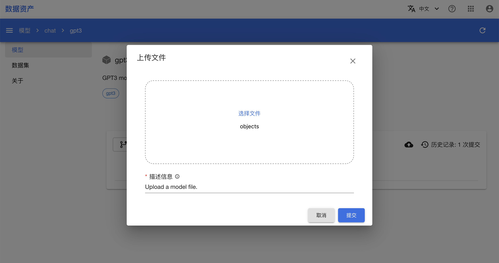
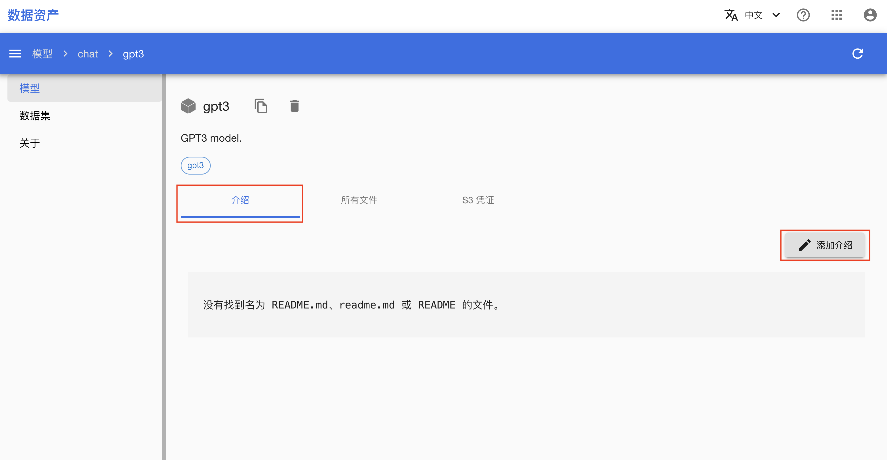
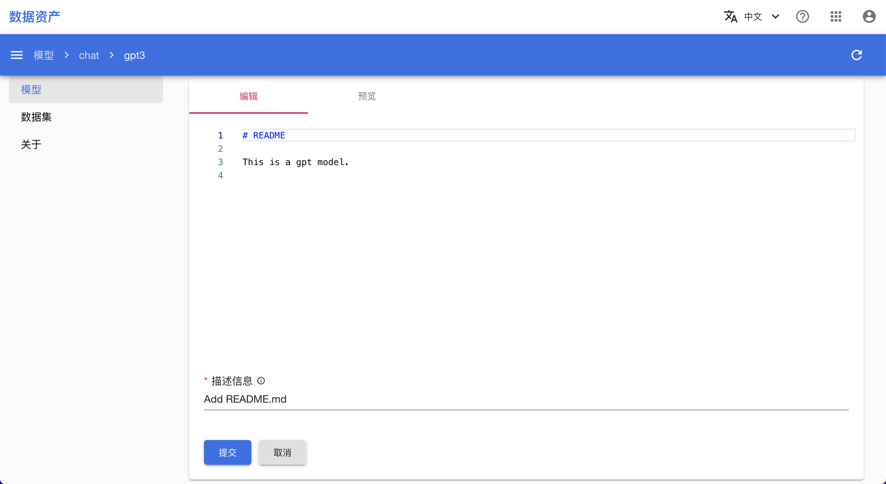
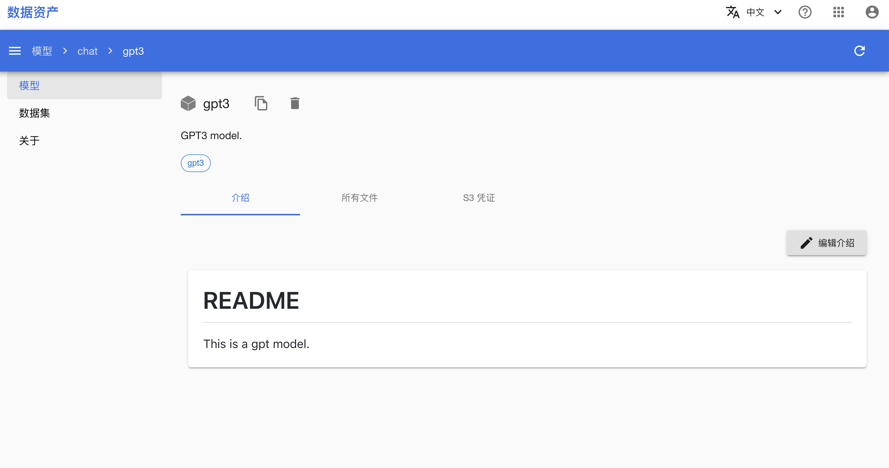
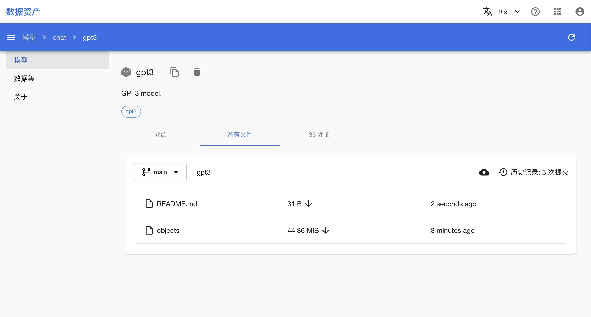

# 操作模型和数据集的对象

本教程演示如何通过多种方式操作模型的对象，包括修改、查看和下载 AssetHub 中存储的对象文件。

数据集同理。

## 准备工作

* 完成教程[操作模型/数据集的分支、tag 和 commit](./manipulate-asset-branch-tag.md)。

## 通过命令行工具

切换到您的工作路径下：

```shell
$ cd /your/workpath
```

操作对象的方式对于模型和数据集都是相同的，除了数据集只允许操作主分支（`main` 分支）中的对象。下面将以模型为例进行演示（这里假设用户名为 `demo`）。

依次创建模型文件夹、模型和分支：

```shell
$ ah create model/llm
AH INFO: Folder /demo/t9k-assethub/model/llm created

$ ah create model/llm/gpt2
AH INFO: Model gpt2 created for Folder /demo/t9k-assethub/model/llm

$ ah create model/llm/gpt2:v1
AH INFO: Branch v1 created for Model /demo/t9k-assethub/model/llm/gpt2
```

使用 `ah commit` 命令向该分支上传本地文件（这里以 `model_state_dict.pt` 和 `README.md` 为例）作为对象存储：

```shell
$ ah commit model/llm/gpt2:v1 --message "Add model file" --add model_state_dict.pt --add README.md
AH INFO: Committing changes to branch /demo/t9k-assethub/model/llm/gpt2:v1
AH INFO: Uploading object 1/2 model_state_dict.pt:
         Done        
AH INFO: Uploading object 2/2 README.md:
         Done        
AH INFO: Commit 29d6f29e created
```

使用 `ah ls` 命令查看分支的所有对象：

```shell
$ ah ls model/llm/gpt2:v1
PATH                   BYTES  CHECKSUM                          MODIFIED
README.md               110B  d1f0e72bd20091c3869cefff8c72661b  1m29s ago
model_state_dict.pt  375943B  1203ee282c235c9fb4c2ea932a7b7cc8  1m29s ago
```

再次使用 `ah commit` 命令，当重复上传文件到同一路径时，原有的对象会被替换：

```shell
$ ah commit model/llm/gpt2:v1 --message "Update README" --add README.md
AH INFO: Committing changes to branch /demo/t9k-assethub/model/llm/gpt2:v1
AH INFO: Uploading object 1/1 README.md:
         Done        
AH INFO: New commit 53097cba created

$ ah ls model/llm/gpt2:v1
PATH                   BYTES  CHECKSUM                          MODIFIED
README.md               221B  84c44f1510389ea7de91e550be8a7130  15s ago
model_state_dict.pt  375943B  1203ee282c235c9fb4c2ea932a7b7cc8  5m37s ago
```

<aside class="note info">
<div class="title">信息</div>
    
每个对象在模型或数据集中存储时都有自己的路径，例如 `file1.txt`、`folder/file2.txt`。多级路径在控制台中会以多级目录的形式展示。

您可以通过 `-a LOCAL_PATH:PATH` 选项来自定义上传文件的存储路径。详细用法请参阅帮助信息 `ah commit --help`。

</aside>

使用 `-d PATH` 选项以删除指定路径的对象：

```shell
$ ah commit model/llm/gpt2:v1 --message "Remove README" --delete README.md
AH INFO: Committing changes to branch /demo/t9k-assethub/model/llm/gpt2:v1
AH INFO: Deleting object README.md:
         Done
AH INFO: Commit cf8dcc26 created

$ ah ls model/llm/gpt2:v1
PATH                   BYTES  CHECKSUM                          MODIFIED
model_state_dict.pt  375943B  1203ee282c235c9fb4c2ea932a7b7cc8  6m2s ago
```

每次使用 `ah commit` 命令修改分支（添加、覆盖或删除对象）时，分支都会创建一个新的 commit。使用 `ah ls commit` 命令查看上面的操作所创建的 3 个 commit：

```shell
$ ah ls model/llm/gpt2:v1 --commit
COMMIT_ID     MESSAGE               CREATED
cf8dcc26      Remove README         5m47s ago
53097cba      Update README         21m46s ago
29d6f29e      Add model file        33m8s ago
c4bebb3a      Repository created    33m18s ago   # 初始 commit
```

之后想要使用这些对象时，使用 `ah download` 命令下载对象保存为本地文件：

```shell
$ ah download model/llm/gpt2:v1
AH INFO: Downloading object 1/1 model_state_dict.pt:
         ━━━━━━━━━━━━━━━━━━━━━━━━━━ 100.0% • 375.9/375.9 kB • 2.6 MB/s • 0:00:00

$ ls
model_state_dict.pt ...
```

## 通过 Python SDK

切换到您的工作路径下，然后以任意方式执行下面的 Python 代码。

导入 `t9k.ah` 模块，使用 `ah.login()` 函数登录到 Asset Hub 服务器（如果配置文件中的凭据仍有效，则无需提供参数）：

```python
from t9k import ah

ah.login(host='<asset-hub-server-url>',
         api_key='<your-api-key>')
```

```
AH INFO: Logged in to Asset Hub server and AIStore server as user <your-user-name>
```

操作对象的方式对于模型和数据集都是相同的，除了数据集只允许操作主分支（`main` 分支）中的对象。下面将以模型为例进行演示（这里以 `user` 表示当前用户）。

依次创建模型文件夹、模型和分支：

```python
model_folder = ah.create('model/llm')
model = ah.create('model/llm/gpt2')
branch = ah.create('model/llm/gpt2:v1')
```

```
AH INFO: Folder /demo/t9k-assethub/model/llm created
AH INFO: Model gpt2 created for Folder /demo/t9k-assethub/model/llm
AH INFO: Branch v1 created for Model /demo/t9k-assethub/model/llm/gpt2
```

使用 `ah.commit()` 函数向该分支上传本地文件作为对象存储：

```python
commit1 = ah.commit('model/llm/gpt2:v1',
                    msg='Add model file',
                    add=['model_state_dict.pt', 'README.md'])
```

```
AH INFO: Committing changes to branch /demo/t9k-assethub/model/llm/gpt2:v1
AH INFO: Uploading object model_state_dict.pt:
         Done        
AH INFO: Uploading object README.md:
         Done        
AH INFO: Commit 6a57546b created
```

<aside class="note tip">
<div class="title">提示</div>

亦可使用 `Branch` 实例的 `create_commit()` 方法完成上述操作。

</aside>

使用 `ah.list()` 函数查看分支的所有对象：

```python
from pprint import pprint

pprint(ah.list('model/llm/gpt2:v1'))
```

```
[{'checksum': 'f0db68fc4327c528b3a23fdc47c30c9e',
  'content_type': 'application/octet-stream',
  'mtime': 1683881423,
  'path': 'README.md',
  'path_type': 'object',
  'physical_address': 's3://t9k-aistore/d3a98ad0-50ca-42df-becf-8bbf4351d2c9/data/gnoggd0i2hci2stu7uhg/chevrjoi2hci2stu7un0',
  'size_bytes': 110},
 {'checksum': '1203ee282c235c9fb4c2ea932a7b7cc8',
  'content_type': 'application/octet-stream',
  'mtime': 1683881423,
  'path': 'model_state_dict.pt',
  'path_type': 'object',
  'physical_address': 's3://t9k-aistore/d3a98ad0-50ca-42df-becf-8bbf4351d2c9/data/gnoggd0i2hci2stu7uhg/chevrjgi2hci2stu7umg',
  'size_bytes': 375943}]
```

<aside class="note tip">
<div class="title">提示</div>

亦可使用 `Branch` 实例的 `list_object()` 方法完成上述操作。

</aside>

再次使用 `ah.commit()` 函数，当重复上传文件到同一路径时，原有的对象会被替换：

```python
commit2 = ah.commit('model/llm/gpt2:v1', msg='Update README', add=['README.md'])

pprint(ah.list('model/llm/gpt2:v1'))
```

```
AH INFO: Committing changes to branch /demo/t9k-assethub/model/llm/gpt2:v1
AH INFO: Uploading object README.md:
         Done        
AH INFO: Commit 8183e1df created
[{'checksum': '1cbd5021ee923905bbdc29883c50a1b0',
  'content_type': 'application/octet-stream',
  'mtime': 1683881478,
  'path': 'README.md',
  'path_type': 'object',
  'physical_address': 's3://t9k-aistore/d3a98ad0-50ca-42df-becf-8bbf4351d2c9/data/gnoggd0i2hci2stu7uhg/chevs1gi2hci2stu7uog',
  'size_bytes': 221},
 {'checksum': '1203ee282c235c9fb4c2ea932a7b7cc8',
  'content_type': 'application/octet-stream',
  'mtime': 1683881423,
  'path': 'model_state_dict.pt',
  'path_type': 'object',
  'physical_address': 's3://t9k-aistore/d3a98ad0-50ca-42df-becf-8bbf4351d2c9/data/gnoggd0i2hci2stu7uhg/chevrjgi2hci2stu7umg',
  'size_bytes': 375943}]
```

使用 `delete` 选项以删除指定路径的对象：

```python
commit3 = ah.commit('model/llm/gpt2:v1', msg='Remove README', delete=['README.md'])

pprint(branch.list_object())
```

```
AH INFO: Committing changes to branch /demo/t9k-assethub/model/llm/gpt2:v1
AH INFO: Deleting object README.md:
         Done
AH INFO: Commit 00af1151 created
[{'checksum': '1203ee282c235c9fb4c2ea932a7b7cc8',
  'content_type': 'application/octet-stream',
  'mtime': 1683881423,
  'path': 'model_state_dict.pt',
  'path_type': 'object',
  'physical_address': 's3://t9k-aistore/d3a98ad0-50ca-42df-becf-8bbf4351d2c9/data/gnoggd0i2hci2stu7uhg/chevrjgi2hci2stu7umg',
  'size_bytes': 375943}]
```

每次使用 `ah.commit()` 函数修改分支（添加、覆盖或删除对象）时，分支都会创建一个新的 commit。继续使用 `ah.list()` 函数查看上面的操作所创建的 3 个 commit：

```python
pprint(ah.list('model/llm/gpt2:v1', resource='commit'))
```

```
[{'committer': 'admin',
  'creation_date': 1683881538,
  'id': '00af1151865121a79233af326b21864f2f6dbcc3b5bebb2f8768e2b13154f754',
  'message': 'Remove README',             # commit3
  'meta_range_id': 'c959b9ce4301591b82517c97ca277b034fd4a4d181b63db7571a2a8174844848',
  'metadata': {},
  'parents': ['8183e1dfb0dcded478aff1b5cb2975ae22e83ca4f37333fb904e5bcd27897923']},
 {'committer': 'admin',
  'creation_date': 1683881479,
  'id': '8183e1dfb0dcded478aff1b5cb2975ae22e83ca4f37333fb904e5bcd27897923',
  'message': 'Update README',             # commit2
  'meta_range_id': '2184d241abdc0ce3e26db44ad2c1df3e1e6a7a6b231fa1f17db7684982a55243',
  'metadata': {},
  'parents': ['6a57546b1275ba6b7f1399e0f7213552ac7bdf545de8692e494db47b93623b9d']},
 {'committer': 'admin',
  'creation_date': 1683881423,
  'id': '6a57546b1275ba6b7f1399e0f7213552ac7bdf545de8692e494db47b93623b9d',
  'message': 'Add model file',            # commit1
  'meta_range_id': '0b8943e0b3b4a3b8661f6146f47f85562aea5c7eb88bc2c66f2adf7443a08451',
  'metadata': {},
  'parents': ['610af4d2991e5c9b9d527dedf34db3cd11c8bd5bb7cc0e8ed0b97505319f8f11']},
 {'committer': '',
  'creation_date': 1683881388,
  'id': '610af4d2991e5c9b9d527dedf34db3cd11c8bd5bb7cc0e8ed0b97505319f8f11',
  'message': 'Repository created',        # 初始 commit
  'meta_range_id': '',
  'metadata': {},
  'parents': []}]
```

<aside class="note tip">
<div class="title">提示</div>

亦可使用 `Branch` 实例的 `list_commit()` 方法完成上述操作。

</aside>

之后想要使用这些对象时，使用 `ah.download()` 函数下载对象保存为本地文件：

```python
ah.download('model/llm/gpt2:v1')

import os
print(os.listdir())
```

```
AH INFO: Downloading object 1/1 model_state_dict.pt:
         ━━━━━━━━━━━━━━━━━━━━━━━━━━ 100.0% • 375.9/375.9 kB • 2.6 MB/s • 0:00:00
['model_state_dict.pt', ...]
```

<aside class="note tip">
<div class="title">提示</div>

亦可使用 `Branch` 实例的 `download()` 方法完成上述操作。

</aside>

## 通过控制台

数据集的控制台操作和模型完全一致。本教程后续仅展示模型对象的上传和下载，您可以用同样的方式操作数据集。

在进行教程之前，先按照[操作文件夹、模型和数据集](./manipulate-folder-asset.md)一节完成模型文件夹和模型的创建（chat/gpt3）。

进入模型详情页后，点击**所有文件 > 上传图标**：

<figure class="screenshot">
  
</figure>

点击**选择文件**选择所要上传的文件，填写描述信息，然后点击**提交**：

<figure class="screenshot">
  
</figure>

完成提交后，可以在**所有文件**中看到刚刚上传的文件，点击**下载图标**下载该文件：

<figure class="screenshot">
  
</figure>

点击**介绍 > 添加介绍**：

<figure class="screenshot">
  
</figure>

在编辑框中按照 `markdown` 格式编辑模型的描述信息，填写提交信息，点击**提交**：

<figure class="screenshot">
  
</figure>

添加完介绍后，在模型详情页可以看到模型介绍：

<figure class="screenshot">
  
</figure>

模型介绍本质上是 **README.md** 文件，在**所有文件**中可以看到：

<figure class="screenshot">
  
</figure>

<aside class="note">
<div class="title">注意</div>

控制台主要用来查看对象，上传、下载对象的操作实现的较为简单，一次仅能处理一个对象。如果希望大批量下载、上传或执行其他更精细的操作，请使用 Python SDK。

</aside>
