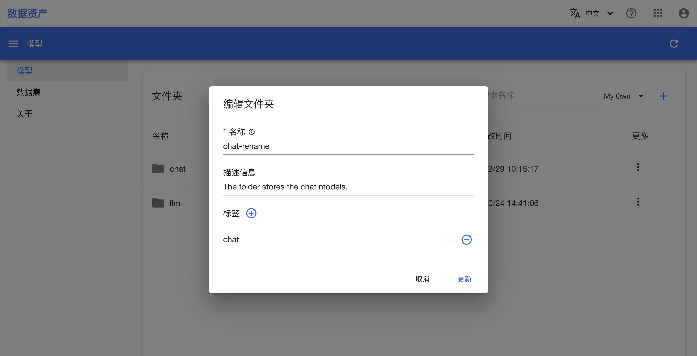
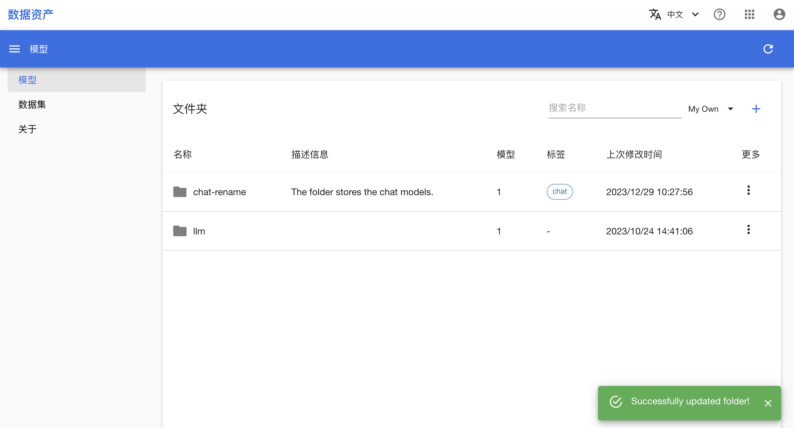
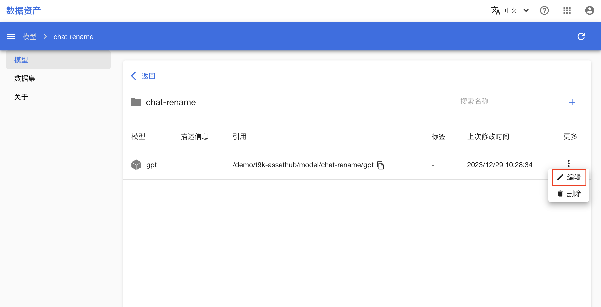
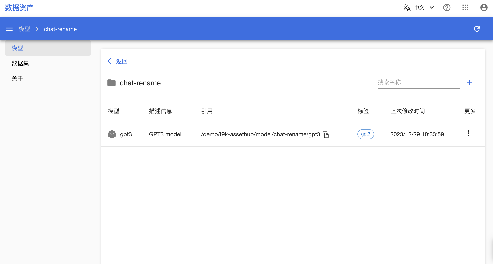

# 修改文件夹、模型和数据集的基本信息

本教程演示如何通过多种方式修改文件夹、模型和数据集的基本信息。

## 准备工作

* 完成教程[操作文件夹、模型和数据集](./manipulate-folder-asset.md)。

## 通过命令行工具

切换到您的工作路径下：

```shell
$ cd /your/workpath
```

修信息的方式对于文件夹、模型和数据集都是相同的。下面将以模型文件夹和模型为例进行演示（这里假设用户名为 `demo`）。

依次创建模型文件夹和模型：

```shell
$ ah create model/llm
AH INFO: Folder /demo/t9k-assethub/model/llm created

$ ah create model/llm/gpt2
AH INFO: Model gpt2 created for Folder /demo/t9k-assethub/model/llm
```

使用 `ah update` 命令修改文件夹和模型的名称：

```shell
$ ah update model/llm -n chat
AH INFO: Folder /demo/t9k-assethub/model/llm updated to /demo/t9k-assethub/model/chat

$ ah update model/chat/gpt2 -n gpt3
AH INFO: Model /demo/t9k-assethub/model/chat/gpt2 updated to /demo/t9k-assethub/model/chat/gpt3
```

使用 `ah ls` 命令查看文件夹和模型的标签：

```shell
$ ah ls model --detail
NAME    PATH                          ...  LABELS  ...
chat    /demo/t9k-assethub/model/chat

$ ah ls model/chat
NAME    PATH                               LABELS  ...
gpt3    /demo/t9k-assethub/model/chat/gpt3
```

两者都没有标签，再次使用 `ah update` 命令为它们添加标签：

```shell
$ ah update model/chat --label "NLP" --label "AIGC"
AH INFO: Folder /demo/t9k-assethub/model/chat updated

$ ah ls model --detail
NAME    PATH                          ...  LABELS     ...
chat    /demo/t9k-assethub/model/chat       AIGC, NLP
```

```shell
$ ah update model/chat/gpt3 --label "GPT"
AH INFO: Model /demo/t9k-assethub/model/chat/gpt3 updated

$ ah ls model/chat
NAME    PATH                               LABELS    PERMISSION
gpt3    /demo/t9k-assethub/model/chat/gpt3  GPT       own
```

<aside class="note tip">
<div class="title">提示</div>

标签的更新是全量的：每次添加标签都会移除已有的标签。

</aside>

## 通过 Python SDK

切换到您的工作路径下，然后以任意方式执行下面的 Python 代码。

导入 `t9k.ah` 模块，使用 `ah.login()` 函数登录到 AssetHub 服务器（如果配置文件中的凭据仍有效，则无需提供参数）：

```python
from t9k import ah

ah.login(host='<asset-hub-server-url>',
         api_key='<your-api-key>')
```

```
AH INFO: Logged in to Asset Hub server and AIStore server as user <your-user-name>
```

修改信息的方式对于文件夹、模型和数据集都是相同的。下面将以模型文件夹和模型为例进行演示（这里假设用户名为 `demo`）。

依次创建模型文件夹和模型：

```python
model_folder = ah.create('model/llm')
model = ah.create('model/llm/gpt2')
```

```
AH INFO: Folder /demo/t9k-assethub/model/llm created
AH INFO: Model gpt2 created for Folder /demo/t9k-assethub/model/llm
```

使用 `ah.update()` 函数修改文件夹和模型的名称：

```python
ah.update('model/llm', name='chat')
ah.update('model/chat/gpt2', name='gpt3')
```

```
AH INFO: Folder /demo/t9k-assethub/model/llm updated to /demo/t9k-assethub/model/chat
AH INFO: Model /demo/t9k-assethub/model/chat/gpt2 updated to /demo/t9k-assethub/model/chat/gpt3
```

<aside class="note tip">
<div class="title">提示</div>

亦可使用 `Folder` 和 `Model` 实例的 `update()` 方法完成上述操作。

</aside>

使用 `ah.list()` 函数查看文件夹和模型的标签：

```python
from pprint import pprint

pprint(ah.list('model'))
pprint(ah.list('model/chat'))
```

```
[{...
  'labels': [],
  'name': 'chat',
  'path': '/demo/t9k-assethub/model/chat',
  'type': 'Folder'}]
[{...
  'labels': [],
  'name': 'gpt3',
  'path': '/demo/t9k-assethub/model/chat/gpt3',
  'type': 'Model'}]
```

两者都没有标签，继续使用 `ah.update()` 函数为它们添加标签：

```python
ah.update('model/chat', labels=['NLP', 'AIGC'])
ah.update('model/chat/gpt3', labels=['GPT'])
```

```
AH INFO: Folder /demo/t9k-assethub/model/chat updated
AH INFO: Model /demo/t9k-assethub/model/chat/gpt3 updated
```

```python
pprint(ah.list('model'))
pprint(ah.list('model/chat'))
```

```
[{...
  'labels': ['AIGC', 'NLP'],
  'name': 'chat',
  'path': '/demo/t9k-assethub/model/chat',
  'type': 'Folder'}]
[{...
  'labels': ['GPT'],
  'name': 'gpt3',
  'path': '/demo/t9k-assethub/model/chat/gpt3',
  'type': 'Model'}]
```

<aside class="note tip">
<div class="title">提示</div>

标签的更新是全量的：每次添加标签都会移除已有的标签。

</aside>

<aside class="note tip">
<div class="title">提示</div>

亦可使用 `Folder` 和 `Model` 实例的 `update()` 方法完成上述操作。

</aside>

## 通过控制台

数据集文件夹、数据集的控制台操作分别和模型文件夹、模型完全一致。本教程后续仅展示如何修改模型文件夹和模型的基本信息，您可以用同样的方式操作数据集文件夹和数据集。

在进行教程之前，先按照[操作文件夹、模型和数据集](./manipulate-folder-asset.md)一节完成模型文件夹和模型的创建（chat/gpt2）。

在模型文件夹列表中，选中需要修改的模型文件夹，点击**更多 > 编辑**：

<figure class="screenshot">
  
</figure>

填写新的名称和描述信息，添加新标签，点击**更新**按钮：

<figure class="screenshot">
  
</figure>

回到文件夹列表，可以看到文件夹信息发生改变：

<figure class="screenshot">
  
</figure>

点击文件夹名称，进入模型列表，选中需要修改的模型，点击**更多 > 编辑**：

<figure class="screenshot">
  
</figure>

填写新的名称和描述信息，添加新标签，点击**更新**按钮：

<figure class="screenshot">
  
</figure>

回到模型列表，可以看到模型信息发生改变：

<figure class="screenshot">
  
</figure>
