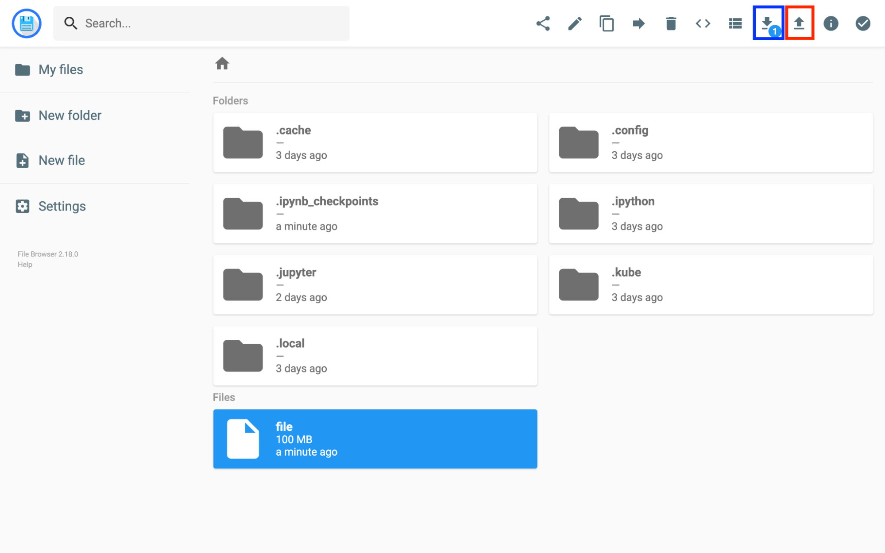
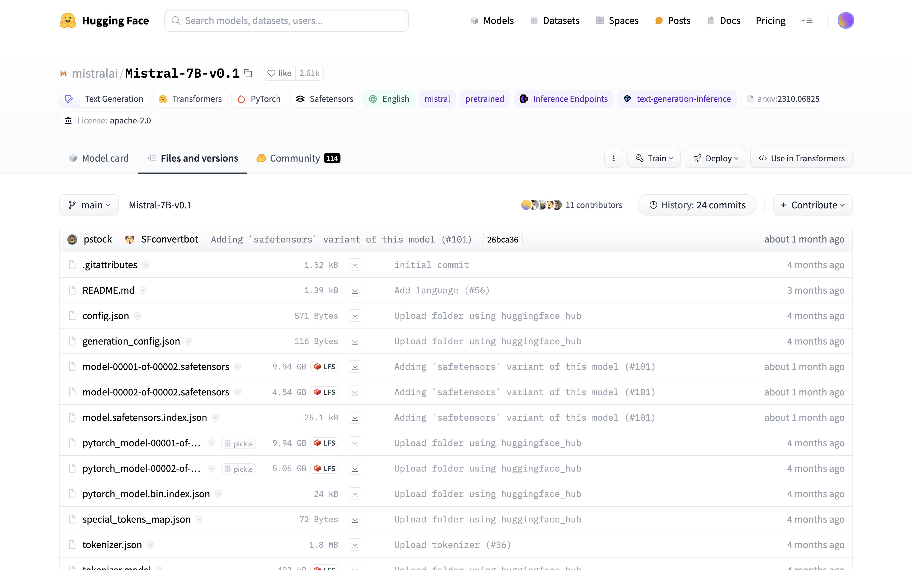
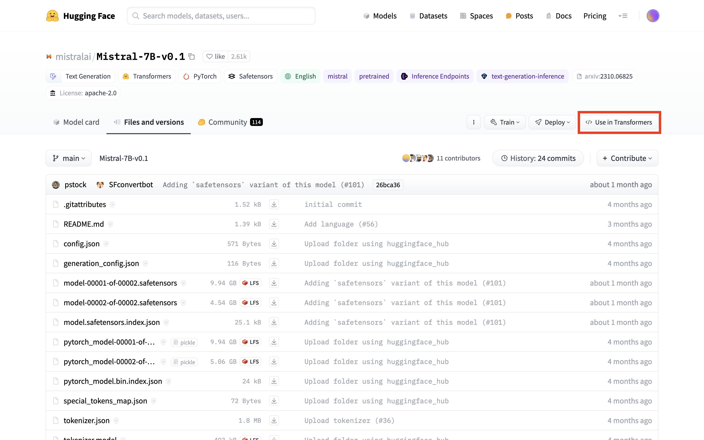
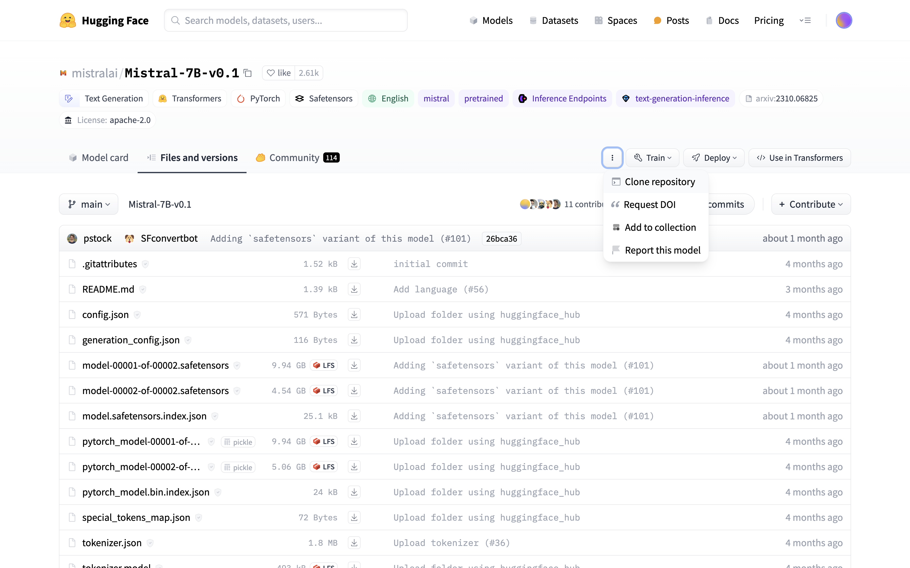
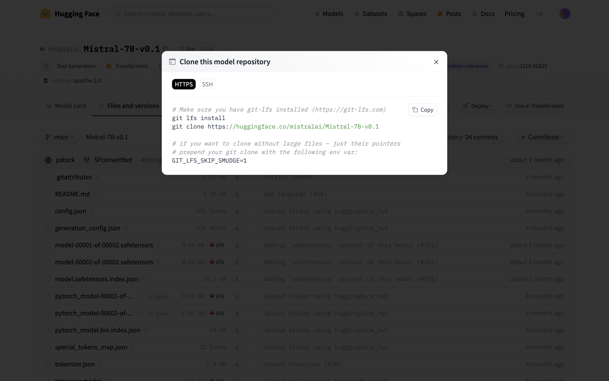

# 上传和下载文件

通过 [PVC](../modules/storage/pvc.md) 使用集群存储非常方便，它可作为存储卷被挂载到 Notebook、Job、MLService 等各种工作负载的 Pod 中。例如在进行模型训练时，用户可以把训练脚本以及训练数据存放到 PVC，然后挂载在 Job 的 Pod 中。

本教程将分场景介绍如何从集群外部上传文件到 PVC，以及如何从 PVC 下载文件到集群外部。

由于下面的部分方法需要使用到命令行工具，而 Notebook 提供了终端并且 Notebook 的镜像中预装了这些命令行工具，因此我们推荐把 PVC 挂载到一个 Notebook 上，然后在 Notebook 中进行操作。

<aside class="note tip">
<div class="title">提示</div>

PVC 可以扩容，即增加存储卷大小。因此用户在创建 PVC 时可以先指定一个较为保守的存储卷大小的值，之后如有需要则继续增加。

</aside>

## 本地文件系统

### Notebook

把 PVC 挂载到 Notebook 上，然后本地的文件和 PVC 之间的文件传输，可直接在 Notebook 的前端页面上操作：

<figure class="screenshot">
  
</figure>

### File Browser

在 PVC 上启动 Explorer 之后，则可通过 [File Browser](../tasks/use-explorer.md#使用-file-browser) ：
<figure class="screenshot">
  
</figure>

<aside class="note">
<div class="title">注意</div>

* Notebook 不限制上传或下载的单个文件的大小（根据管理员配置，File Browser 有可能限制上传的单个文件的大小）；但上传过程容易因为网络波动而出错，建议 > ~5GB（也取决于具体网络环境）的单个文件使用其他方法上传。
* 可以一次上传或下载多个文件；但在文件数量较多（> ~50）的情况下容易出错，推荐打包成压缩文件再上传或下载。

</aside>

### 云存储中转

也可通过其它云存储服务进行中转，即 `本地 -> 云存储 -> 集群 PVC`：

1. 本地与云存储之间的文件传输方法请参阅相应云存储的文档；
2. 云存储与 PVC 之间的文件传输方法请参阅[与云存储传输文件](#与云存储传输文件)。

## 云存储服务

要在云存储与 PVC 之间复制或同步文件，可以在 Notebook 的终端中使用命令行工具 <a target="_blank" rel="noopener noreferrer" href="https://rclone.org">rclone</a>。这里以 Amazon S3 为例，首先参照 <a target="_blank" rel="noopener noreferrer" href="https://rclone.org/s3/">Amazon S3 Config</a> 进行配置，完成后执行以下命令：

```bash
rclone copy <REMOTE>:<BUCKET>/path/to/the/file .   # 从 S3 存储下载
rclone copy ./file <REMOTE>:<BUCKET>/path/to/the/  # 上传到 S3 存储

rclone sync <REMOTE>:<BUCKET>/path/to/the/dir .    # 从 S3 存储同步
rclone sync . <REMOTE>:<BUCKET>/path/to/the/dir    # 同步到 S3 存储
```

<aside class="note info">
<div class="title">信息</div>

rclone 支持的云存储提供商请参阅 <a target="_blank" rel="noopener noreferrer" href="https://rclone.org/#providers">Supported Providers</a>。

</aside>

rclone 之外，还有其他方便的工具可供使用，例如 <a target="_blank" rel="noopener noreferrer" href="https://github.com/s3tools/s3cmd">s3cmd</a>, <a target="_blank" rel="noopener noreferrer" href="https://github.com/peak/s5cmd">s5cmd</a> 等。

## HTTP/FTP 服务

要通过 HTTP(S)、(S)FTP 等协议从网络下载文件到 PVC，可以在 Notebook 的终端中使用 `wget` 或 `curl` 命令进行下载：

```bash
wget <URL>
curl -O <URL>
```

<aside class="note tip">
<div class="title">提示</div>

用户也可以在终端中使用命令行工具 rclone 来访问和下载存储在 HTTP(S) 和 FTP(S) 服务器上的文件（对于 FTP(S) 服务器还可以上传文件）。rclone 将这些服务器视为一种类型的云存储，请参阅 <a target="_blank" rel="noopener noreferrer" href="https://rclone.org/http/">HTTP Config</a> 和 <a target="_blank" rel="noopener noreferrer" href="https://rclone.org/ftp/">FTP Config</a>。

</aside>

## Git 仓库

可以在 Notebook 的终端中使用 `git` 命令，从 GitHub 等代码托管平台克隆或拉取项目，并在提交修改后推送回去：

```bash
git clone <repository>
git pull
git fetch
git push
```

## Hugging Face Hub

<a target="_blank" rel="noopener noreferrer" href="https://huggingface.co/models">Hugging Face Hub</a> 是一个拥有超过 35 万个模型和 7.5 万个数据集的平台，所有这些模型和数据集都是开源并且公开可用的。从 Hugging Face Hub 下载一个模型或数据集有多种方法，下面以模型 `mistralai/Mistral-7B-v0.1` 为例进行演示，首先来到该模型的 <a target="_blank" rel="noopener noreferrer" href="https://huggingface.co/mistralai/Mistral-7B-v0.1/tree/main">Files and versions 标签页</a>：

<figure class="screenshot">
  
</figure>

**方法一**

点击 **Use in Transformers**，按照提示进行操作，即在 Python 程序中调用 `transformers` 库加载模型。首次加载时，模型文件会被下载到缓存目录下，即 PVC 的 `.cache/huggingface/hub/models--mistralai--Mistral-7B-v0.1/` 路径下。

<figure class="screenshot">
  
</figure>

<figure class="screenshot">
  
</figure>

```python
from transformers import pipeline

pipe = pipeline("text-generation", model="mistralai/Mistral-7B-v0.1")

# 或

from transformers import AutoTokenizer, AutoModelForCausalLM

tokenizer = AutoTokenizer.from_pretrained("mistralai/Mistral-7B-v0.1")
model = AutoModelForCausalLM.from_pretrained("mistralai/Mistral-7B-v0.1")
```


<aside class="note">
<div class="title">注意</div>

部分模型和数据集（例如模型 `meta-llama/Llama-2-7b`）在使用前需要先登录到 Hugging Face 并获取访问权限。

</aside>

**方法二**

点击 **Clone repository**，按照提示进行操作，即使用 `git` 命令将模型的 Git 仓库直接克隆到 PVC 中：

<figure class="screenshot">
  
</figure>

<figure class="screenshot">
  
</figure>

```bash
# git lfs install    # Notebook 的镜像中已经预装了 git-lfs，因此不必再执行
git clone https://huggingface.co/mistralai/Mistral-7B-v0.1
```

<aside class="note tip">
<div class="title">信息</div>

模型和数据集都是作为 Git 仓库托管在 Hugging Face Hub 上。

</aside>

**方法三**

如果只需要下载个别文件，例如只下载模型的 safetensors 文件，那么可以复制相应文件的下载链接，然后在终端中使用 `wget` 命令下载：

```bash
wget https://huggingface.co/mistralai/Mistral-7B-v0.1/resolve/main/model-00001-of-00002.safetensors?download=true
wget https://huggingface.co/mistralai/Mistral-7B-v0.1/resolve/main/model-00002-of-00002.safetensors?download=true
```

## 大规模数据

在处理大规模数据（如 100TB 级别）的导入和导出时，根据数据源的不同，我们采用不同的策略以确保数据传输的效率和安全性。以下是针对不同数据源的一些方法：

数据源为云存储时：

* 参照[云存储服务](#云存储服务)操作。

数据源为硬盘驱动器时：

1. 将硬盘驱动器连接到集群外的与集群网络连接速度较快的计算机上，然后参照[本地文件系统](#本地文件系统)继续操作。
2. 请求管理员操作，将硬盘驱动器连接到存储集群的节点上，直接使用存储系统的工具进行数据传输。这种方法的数据传输速度一般较快，但需要能够访问存储集群的工具和接口。

## 参考

<https://rclone.org/>

<https://huggingface.co/models>

<https://github.com/peak/s5cmd>

<https://github.com/s3tools/s3cmd>