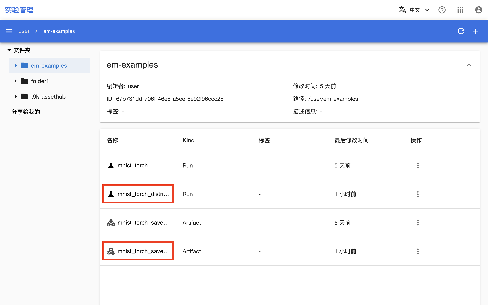
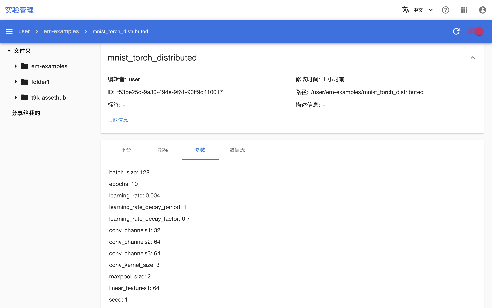

# 分布式训练场景

本教程演示如何记录并展示 PyTorchTrainingJob 分布式训练场景下的训练产生的信息、指标和文件（以 PyTorch 模型的数据并行训练为例）。

<aside class="note info">
<div class="title">信息</div>

对于 Keras 模型，`t9k.em` 提供了使用更加方便的回调，详见[自动记录](./record-using-python-sdk.md#自动记录)。

</aside>

## 运行示例

请按照<a target="_blank" rel="noopener noreferrer" href="https://github.com/t9k/tutorial-examples/blob/v20240206/docs/README-zh.md#%E4%BD%BF%E7%94%A8%E6%96%B9%E6%B3%95">使用方法</a>准备环境，然后前往<a target="_blank" rel="noopener noreferrer" href="https://github.com/t9k/tutorial-examples/tree/v20240206/em/data-parallel-training">本教程对应的示例</a>，参照其 README 文档运行。

下面介绍训练脚本进行了哪些修改以追踪训练。该方法是通用的，可以推广到任意类型的 TrainingJob、DeepSpeedJob、ColossalAIJob、MPIJob 或 GenericJob。

## 准备训练脚本

准备一个 PyTorch 训练脚本，其模型对 MNIST 数据集的图像进行分类，使用 `DistributedDataParallel`（DDP）模块进行分布式训练，具体代码如下所示（这里使用与[使用 PyTorchTrainingJob 进行数据并行训练](./pytorch-training-parallel.md)相同的脚本）。接下来将在此脚本的基础上进行简单的修改以进行追踪。

<details><summary><code class="hljs">torch_mnist_trainingjob_em.py</code></summary>

```python
{{ #include ../assets/tasks/record-distributed-training/torch_mnist_trainingjob_em.py }}
```

</details>

## 创建 Run

创建一个包含所有（想要记录的）超参数的 Python 字典。

```python
from t9k import em

if __name__ == '__main__':
    ...
    hparams = {
        'batch_size': 32 * world_size,
        'epochs': 10,
        'learning_rate': 0.001 * world_size,
        'learning_rate_decay_period': 1,
        'learning_rate_decay_factor': 0.7,
        'conv_channels1': 32,
        'conv_channels2': 64,
        'conv_channels3': 64,
        'conv_kernel_size': 3,
        'maxpool_size': 2,
        'linear_features1': 64,
        'seed': 1,
    }
    ...
```

**指定一个工作器**负责在建立模型之前创建并初始化一个 `Run` 实例，传入名称和上面的超参数字典。

```python
if __name__ == '__main__':
    ...
    if rank == 0:
        run = em.create_run(name='mnist_torch_distributed', hparams=hparams)
    ...
```

## 使用设定的超参数配置模型

使用上面的超参数字典的值替换直接提供的超参数值，以配置模型各层、数据集、优化器、训练流程等。

```python
class Net(nn.Module):
    def __init__(self):
        super().__init__()
        self.conv1 = nn.Conv2d(1, hparams['conv_channels1'],
                               hparams['conv_kernel_size'], 1)
        self.conv2 = nn.Conv2d(hparams['conv_channels1'],
                               hparams['conv_channels2'],
                               hparams['conv_kernel_size'], 1)
        self.conv3 = nn.Conv2d(hparams['conv_channels2'],
                               hparams['conv_channels3'],
                               hparams['conv_kernel_size'], 1)
        self.pool = nn.MaxPool2d(hparams['maxpool_size'],
                                 hparams['maxpool_size'])
        self.dense1 = nn.Linear(576, hparams['linear_features1'])
        self.dense2 = nn.Linear(hparams['linear_features1'], 10)
    ...

if __name__ == '__main__':
    ...
    torch.manual_seed(hparams['seed'])
    ...
    optimizer = optim.Adam(model.parameters(), lr=hparams['learning_rate'])
    scheduler = optim.lr_scheduler.StepLR(
        optimizer,
        step_size=hparams['learning_rate_decay_period'],
        gamma=hparams['learning_rate_decay_factor'])
    ...
    train_loader = torch.utils.data.DataLoader(
        train_dataset,
        batch_size=hparams['batch_size'],
        shuffle=True,
        **kwargs)
    ...
    epochs = hparams['epochs']
    ...
```

## 记录指标

在模型的训练和测试过程中，**被指定的工作器**调用 `Run` 实例的 `log()` 方法以记录模型在此期间产生的指标。

```python
def train(scheduler):
    ...
            if step % (500 // world_size) == 0:
                train_loss = loss.item()
                logging.info(
                    'epoch {:d}/{:d}, batch {:5d}/{:d} with loss: {:.4f}'.
                    format(epoch, epochs, step, steps_per_epoch, train_loss))
                global_step = (epoch - 1) * steps_per_epoch + step

                if rank == 0:
                    run.log(type='train',                  # 记录训练指标
                            metrics={'loss': train_loss},  # 指标名称及相应值
                            step=global_step,              # 当前全局步数
                            epoch=epoch)                   # 当前回合数
    ...

def test(val=False, epoch=None):
    ...
    test_loss = running_loss / len(loader)
    test_accuracy = correct / len(loader.dataset)
    msg = '{:s} loss: {:.4f}, {:s} accuracy: {:.4f}'.format(
        label, test_loss, label, test_accuracy)
    if val:
        msg = 'epoch {:d}/{:d} with '.format(epoch, epochs) + msg
    logging.info(msg)

    if rank == 0:
        run.log(type=label,    # 记录验证/测试指标
                metrics={
                    'loss': test_loss,
                    'accuracy': test_accuracy,
                },
                step=global_step,
                epoch=epoch)

```

## 创建 Artifact 并添加模型检查点文件

在保存模型检查点文件之后，**被指定的工作器**创建并初始化一个新的 `Artifact` 实例，为其添加该检查点文件，并标记为 Run 的输出。

```python
if __name__ == '__main__':
    ...
    if rank == 0:
        torch.save(model.state_dict(), 'model_state_dict.pt')
        model_artifact = em.create_artifact(name='mnist_torch_saved_model')
        model_artifact.add_file('model_state_dict.pt')
        run.mark_output(model_artifact)
    ...
```

## 结束和上传试验

模型的训练和测试结束后，**被指定的工作器**调用 `Run` 实例的 `finish()` 和 `upload()` 方法以结束和上传 Run（Artifact 也会被一并上传）。在上传之前需要调用 `em.login()` 函数以登录到服务器。

```python
if __name__ == '__main__':
    ...
    if rank == 0:
        run.finish()
        em.login()
        run.upload(folder='em-examples', make_folder=True)

```

## 检查 Run 和 Artifact

训练结束后，进入实验管理控制台，可以看到名为 mnist_torch_distributed 的 Run 及其输出的 Artifact 被上传：

<figure class="screenshot">
    
</figure>

点击 Run 或 Artifact 的名称进入其详情页面，可以看到 Run 的平台信息、指标、超参数和数据流，以及 Artifact 的文件和数据流。并且它们的数据流是连通的。

<figure class="screenshot">
    
</figure>

<figure class="screenshot">
    
</figure>

<figure class="screenshot">
    
</figure>
