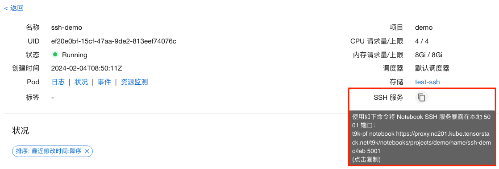
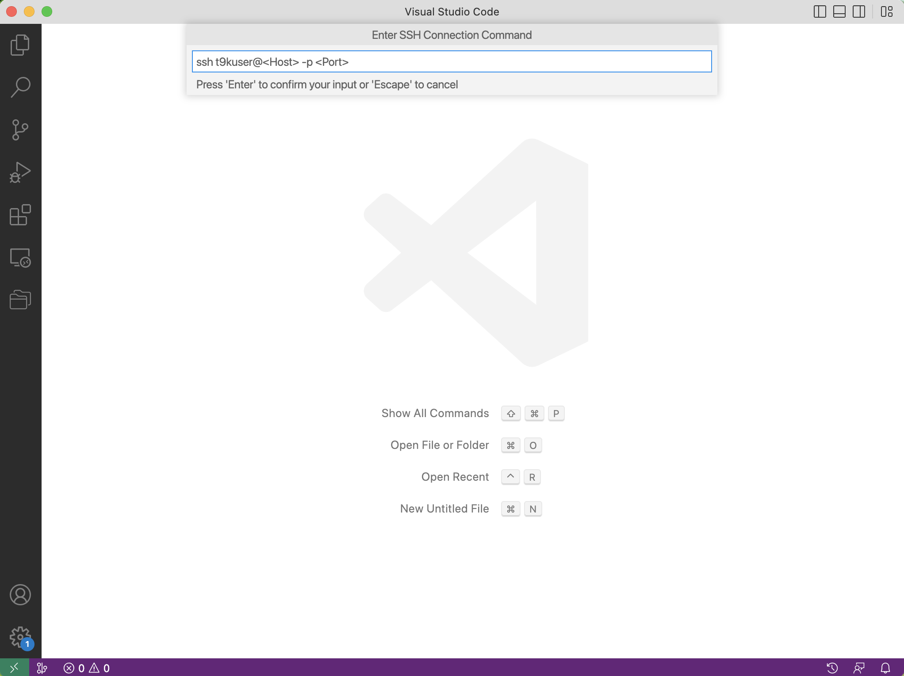
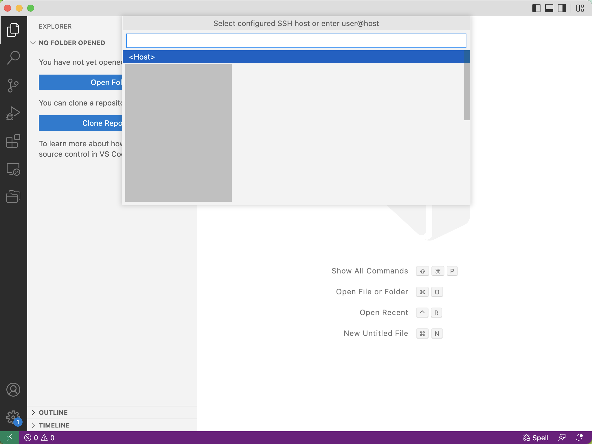
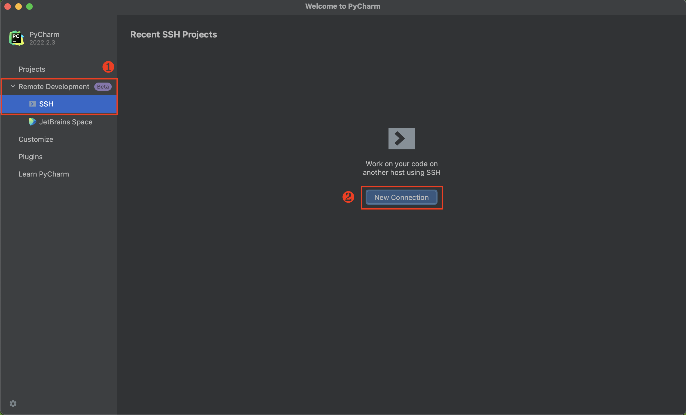

# 通过 SSH 远程使用 Notebook

本教程演示如何通过 SSH 连接远程使用 Notebook。

## 准备工作

* 创建了一个[启用 SSH 选项](./create-notebook.md#启用-ssh-选项) 的 Notebook。
* 确认该 Notebook 处于正常运行状态。


## 进行端口转发

### 了解并安装命令行工具 t9k-pf

[t9k-pf 命令行工具](../tools/cli-t9k-pf/index.md)的功能类似于 `kubectl port-forward`，可以让您能够在本地通过端口转发的方式访问 TensorStack AI 平台的各种资源。

t9k-pf 可以从平台首页下载。您需要参考[用户指南](../tools/cli-t9k-pf/guide.md#用户指南)，下载安装 t9k-pf 并配置[身份认证和授权](../tools/cli-t9k-pf/guide.md#身份认证和授权)。

### 获取端口转发命令

在 Notebook 详情页面，您可以查看并复制 “SSH 服务”提示的命令：

<figure class="screenshot">
  
</figure>

在终端输入该命令进行端口转发：

``` bash
$ t9k-pf notebook <URL> <Port>
now you can forward to your target by 127.0.0.1:<Port>
```

参数说明如下：
1. `URL`：Notebook 的 Web UI 地址。除上述获取方式外，您也可以“打开” Notebook 后，复制浏览器地址栏中的地址作为 `URL` 参数使用。
2. `Port`：转发的本地端口。在 [SSH 远程连接教程](#ssh-远程连接)中会使用到该端口。

根据终端打印的提示信息，您可以使用本地的端口与目标 Notebook 建立 SSH 连接，具体命令参照 [SSH 远程连接教程](#ssh-远程连接)。

<aside class="note">
<div class="title">信息</div>

1. 在 port-forward 成功后，您仍然需要保持 t9k-pf 命令行窗口一直保持运行状态。
2. 标准 Notebook 镜像的默认用户是 `t9kuser`，其主目录（home directory）是 `/t9k/mnt`。

</aside>

## SSH 远程连接

### 使用 Terminal

在 Terminal 中运行以下命令以连接到 Notebook：

``` bash
ssh t9kuser@localhost -p <Port> \
  -o StrictHostKeyChecking=no \
  -o GlobalKnownHostsFile=/dev/null \
  -o UserKnownHostsFile=/dev/null
```

<aside class="note info">
<div class="title">信息</div>

Notebook 的 Pod 没有固定的主机密钥（Host Key），上面的命令设置 `StrictHostKeyChecking=no` 来跳过主机密钥的检查，并设置 `GlobalKnownHostsFile=/dev/null` 和 `UserKnownHostsFile=/dev/null` 以避免将主机密钥保存到 known_hosts 文件中。运行上面的命令时会提示 `Warning: Permanently added '[<Host>]:<Port>' (RSA) to the list of known hosts.`，但实际上保存的路径为 `/dev/null`，它会丢弃一切写入的数据。

</aside>

然后在 Terminal 中操作 Notebook：

<figure class="screenshot">
  
</figure>

### 使用 VSCode

#### 安装 Remote SSH 插件

在 VSCode 中搜索 **<a target="_blank" rel="noopener noreferrer" href="https://marketplace.visualstudio.com/items?itemName=ms-vscode-remote.remote-ssh">Remote - SSH</a>** 插件并安装：

<figure class="screenshot">
  
</figure>

#### 添加 SSH Config

安装完成后，需要在 SSH Config 中添加主机（Notebook）的信息。

<aside class="note tip">
<div class="title">提示</div>

如果你熟悉 SSH，直接编辑位于 `$HOME/.ssh/config` 的配置文件，添加以下信息：

``` bash
Host localhost
  HostName 127.0.0.1
  User t9kuser
  Port <Port>
```

确认无误后，保存文件即可。

</aside>

VSCode 提供了编辑 SSH Config 的方式。点击左下角的绿色 **><** 符号，选择 **Connect to Host**，然后拉动滚动条到最下方，点击 **Add New SSH Host**：

<figure class="screenshot">
  
</figure>

根据提示，输入以下内容，然后按下回车键（Enter）：

``` bash
ssh t9kuser@localhost -p <Port>
```

<figure class="screenshot">
  
</figure>

VSCode 会提示 **Select SSH configuration file to update**，第一个选择项通常是位于 `$HOME/.ssh/config` 的配置文件，你可以选择将主机的信息存储在第一个配置文件中。

#### 连接到 Notebook

点击左下角的绿色 **><** 符号，选择 **Connect to Host**：

<figure class="screenshot">
  
</figure>

然后选择 SSH Config 中对应的主机名（使用上述配置方式时，主机名为 `localhost`）：

<figure class="screenshot">
  
</figure>

VSCode 会新建一个窗口，等待连接建立之后，左下角会提示 **SSH: Host**。点击 Open Folder 可以选择打开的目录或者文件。你可以和本地开发一样使用 VSCode 来操作 Notebook：

<figure class="screenshot">
  
</figure>

### 使用 PyCharm

使用 PyCharm 远程连接到 Notebook 需要满足以下前提条件：

1. 安装了 PyCharm 专业版，且版本不低于 2022.2。PyCharm 有专业版（Professional）和社区版（Community），目前仅 PyCharm Professional 支持远程 SSH 开发。
2. Notebook 的资源配置至少为 3 个 CPU，3 GiB 内存，Notebook 绑定的持久卷至少有 2.5 GiB 的可用空间。推荐配置为至少 4 个 CPU，4 GiB 内存，5 GiB 持久卷。

<aside class="note info">
<div class="title">信息</div>

使用 PyCharm 远程连接 Notebook 进行开发时，PyCharm 需要在 Notebook 容器中安装并运行一个 IDE Backend（参阅<a target="_blank" rel="noopener noreferrer" href="https://www.jetbrains.com/help/pycharm/remote-development-overview.html">官方文档</a>）。结合官方推荐的配置和实际测试，我们给出了上面的资源配置要求。

</aside>

打开 PyCharm，在左侧的导航菜单中点击 **Remote Development > SSH**，然后点击右侧的 **New Connection**：

<figure class="screenshot">
  
</figure>

在弹出的对话框中填写如下参数：

* `Username`：SSH 使用的用户名。
* `Host`：主机地址，通常为 `127.0.0.1`。
* `Port`：端口。
* `Specify private key`：建议勾选，并选择与你[存储的公钥](create-notebook.md#存储-ssh-公钥)对应的私钥。

<figure class="screenshot">
  
</figure>

点击 **Check Connection and Continue**，进入下一步：

<figure class="screenshot">
  
</figure>

这里选择了在 Notebook 中安装的 IDE Backend 版本为 PyCharm 2022.2.3，远程打开的项目目录为 `/t9k/mnt`。点击 **Download IDE and Connect** 后，就可以通过 PyCharm 访问 Notebook 中的文件了。

<aside class="note">
<div class="title">注意</div>

第一次 SSH 连接到 Notebook 中时，需要等待 Notebook 下载 IDE Backend。根据网络情况不同，这一步骤可能耗时几分钟到十几分钟。

</aside>

<figure class="screenshot">
  
</figure>

你可以和本地开发一样使用 PyCharm 来操作 Notebook：
