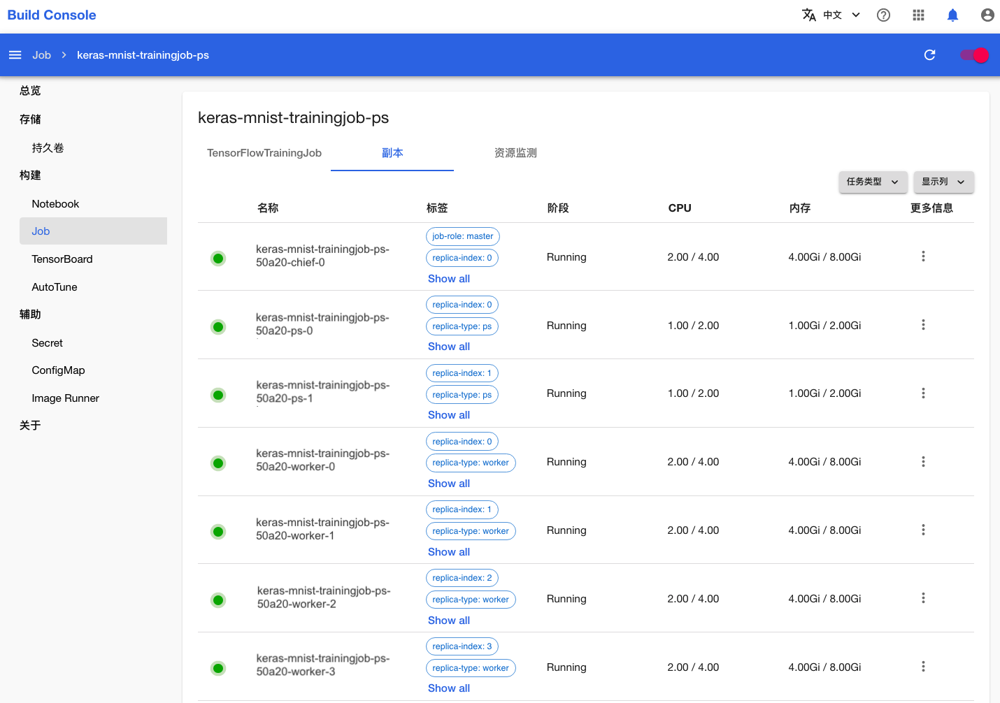
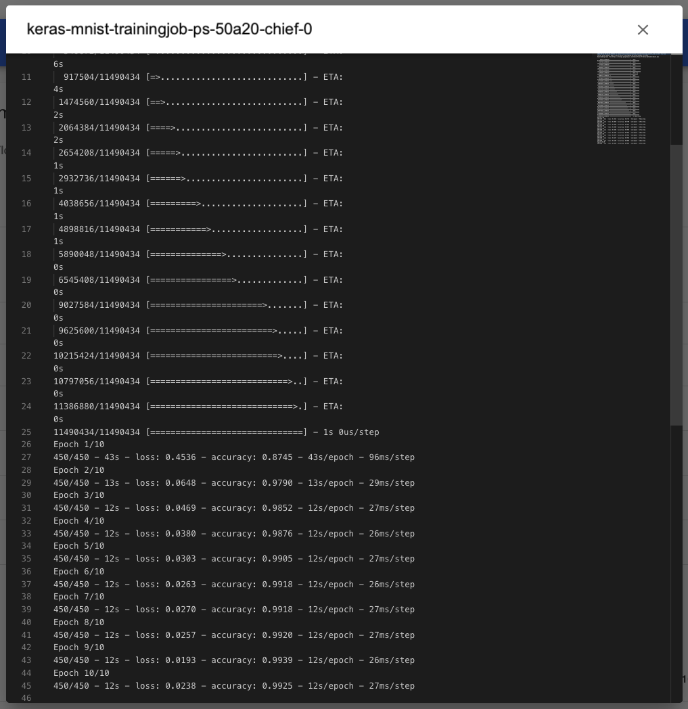

# 使用 TensorFlowTrainingJob 进行参数服务器训练

本教程演示如何使用 TensorFlowTrainingJob 对 Keras 模型进行参数服务器（parameter server）训练（采用 <a target="_blank" rel="noopener noreferrer" href="https://www.tensorflow.org/api_docs/python/tf/distribute/experimental/ParameterServerStrategy">`tf.distribute.experimental.ParameterServerStrategy`</a> 分布式策略）。

## 运行示例

请按照<a target="_blank" rel="noopener noreferrer" href="https://github.com/t9k/tutorial-examples/blob/master/docs/README-zh.md#%E4%BD%BF%E7%94%A8%E6%96%B9%E6%B3%95">使用方法</a>准备环境，然后前往<a target="_blank" rel="noopener noreferrer" href="https://github.com/t9k/tutorial-examples/tree/master/job/tensorflowtrainingjob/ps">本教程对应的示例</a>，参照其 README 文档运行。

!!! tip "提示"
    除了上述直接提供 YAML 配置文件的方法外，您也可以选择从网页控制台创建 TensorFlowTrainingJob。

## 检查训练日志和指标

训练开始后，进入模型构建控制台的 Job 页面，可以看到名为 **keras-mnist-trainingjob-ps** 的 TensorFlowTrainingJob 正在运行：

<figure class="screenshot">
    
</figure>

点击**该名称**进入详情页面，可以看到刚才创建的 TensorFlowTrainingJob 的基本信息、状况信息和事件信息：

<figure class="screenshot">
    
</figure>

点击 **TensorBoard** 右侧的 **Running** 打开 TensorBoard，可以查看可视化展示的训练和验证指标：

<figure class="screenshot">
    
</figure>

点击上方标签页的**副本**，查看 TensorFlowTrainingJob 的 Pod 信息：

<figure class="screenshot">
    
</figure>

点击 Pod 列表右侧，**更多信息**下的 **:material-dots-vertical:&nbsp;> 日志**以查看训练脚本执行过程中的日志输出：

<figure class="screenshot">
    
</figure>

点击上方标签页的**指标**，查看 TensorFlowTrainingJob 运行过程中使用集群计算资源、网络资源和存储资源的情况：

<figure class="screenshot">
    
</figure>

一段时间之后，TensorFlowTrainingJob 的状态变为 **Succeeded**，表示训练成功完成。

<figure class="screenshot">
    
</figure>

若 TensorFlowTrainingJob 在运行过程中出错，其状态会变为 **Error**，并在事件信息和 Pod 信息部分显示错误信息，此时需要根据给出的错误信息进行问题排查。

!!! tip "提示"
    除了上述方法外，您也可以在 Notebook 中直接使用 `kubectl` 命令查看 TensorFlowTrainingJob 以及其下各个 Pod 的状态、基本信息、事件、日志等以检查训练的进度和结果。
