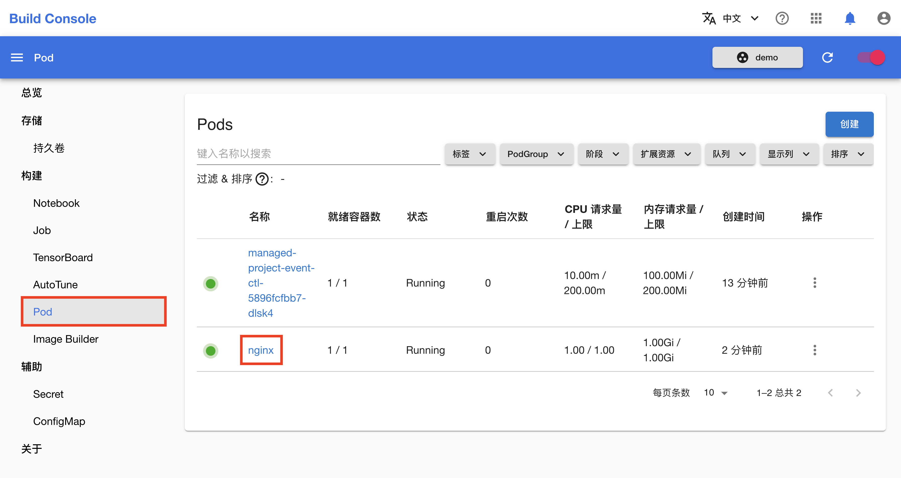
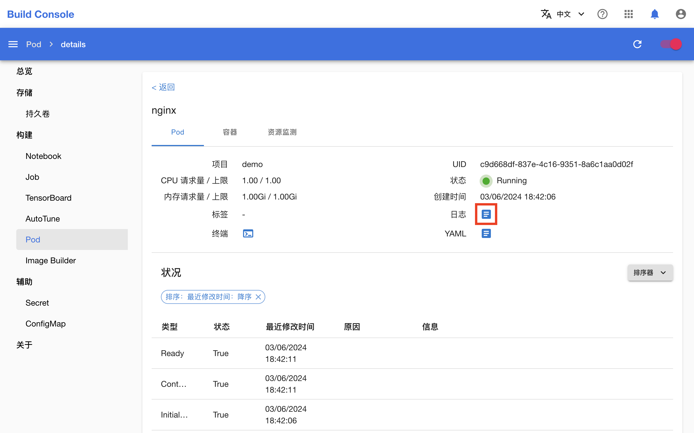
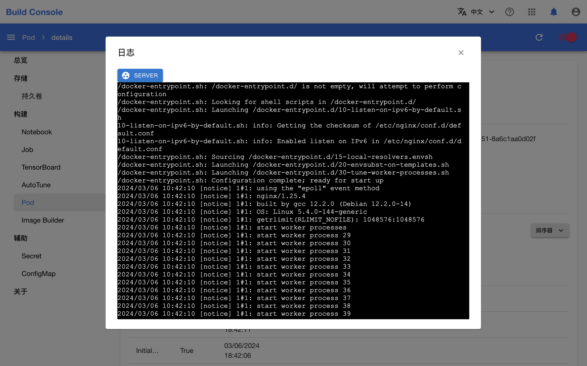

# 小技巧

本教程汇总了一些实用的小技巧，可以帮助用户更好地使用平台。

## 让 Notebook 不被资源回收

如果想要让 Notebook 不被[资源回收](../modules/scheduling/reclaim.md)，可以在该 Notebook 中[创建一个 Jupyter Notebook](./use-notebook.md#使用-jupyter-notebook)，并运行以下代码：

```python
# To keep the kernel active
import time

while True:
    time.sleep(60)
```

上述代码使 Notebook 保持活跃状态，而又不占用额外的计算资源。如要恢复对该 Notebook 的资源回收，只需停止上述代码的运行即可。

## 在终端中了解 Kubernetes API 资源及其字段

在创建、查看或调试 Kubernetes API 资源（包括 Kubernetes 原生资源和平台提供的 CRD）时，我们需要了解资源有哪些字段以及它们的含义。要获取这些信息，一种方法是查阅相应的参考文档，但更便捷的方式是在终端使用 `kubectl explain` 命令：

```bash
# 获取资源及其字段的描述
kubectl explain pod

# 获取资源的指定字段及其子字段的描述
kubectl explain pod.spec.containers

# 获取资源的所有子字段
kubectl explain pod --recursive
```

例如现在我们想要启用 DeepSpeedJob 的调试模式，但不知道该如何编写 YAML 配置文件，那么可以在 Notebook 的终端中执行以下命令：

```bash
kubectl explain dj --recursive    # `dj` 是 DeepSpeedJob 的简称
```

输出应类似于：

```
KIND:     DeepSpeedJob
VERSION:  batch.tensorstack.dev/v1beta1

DESCRIPTION:
     DeepSpeedJob defines the schema for the DeepSpeedJob API.

FIELDS:
   ...
   spec <Object>
      ...
      runMode   <Object>
         debug  <Object>
            enabled     <boolean>
            replicaSpecs        <[]Object>
               command  <[]string>
               skipInitContainer        <boolean>
               type     <string>
         pause  <Object>
            enabled     <boolean>
            resumeSpecs <[]Object>
               args     <[]string>
               command  <[]string>
               skipInitContainer        <boolean>
               type     <string>
      ...
   ...
```

由此我们得以写出正确的配置：

```yaml
apiVersion: batch.tensorstack.dev/v1beta1
kind: DeepspeedJob
metadata:
  name: deepspeed-example
spec:
  runMode:
    debug:
      enabled: true
  ...
```

## 查看容器的日志

查看 Pod 中的容器的日志有两种方法。第一种方法是在终端使用 `kubectl logs` 命令：

```bash
# 首先列举所有 Pod
kubectl get pod

# 返回指定 Pod 的（唯一容器的）日志快照
kubectl logs nginx

# 持续输出日志
kubectl logs -f nginx

# 返回日志的最后 20 行
kubectl logs --tail=20 nginx

# 返回最近 1 个小时的日志
kubectl logs --since=1h nginx
```

第二种方法是在控制台中查看。进入模型构建控制台，在左侧的导航菜单中点击**构建 > Pod** 进入 Pod 管理页面，然后点击 Pod 的名称进入详情页面：

<figure class="screenshot">
    
</figure>

点击**日志右侧的按钮**即可查看日志：

<figure class="screenshot">
    
</figure>

<figure class="screenshot">
    
</figure>

此外，部分 CRD 所创建的 Pod 的容器日志也可以从相应 CRD 的详情页面查看，请参阅：

* [查看 Job 的容器日志](./pytorch-training-parallel.md#检查训练日志和指标)
* [查看 Image Builder 的容器日志](./build-image.md#检查构建进度和结果)
