# 在实验管理控制台查看和管理数据

本教程演示如何使用实验管理控制台来查看和管理记录的模型训练数据。

## 进入实验管理控制台

在 TensorStack AI 平台的首页，点击**实验管理**进入实验管理控制台。

<figure class="screenshot">
    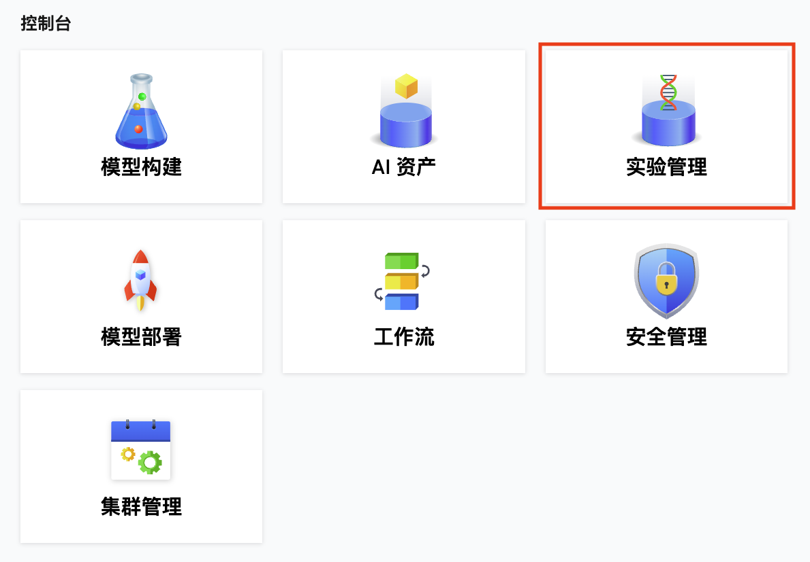
</figure>

## 浏览文件夹

当前用户的所有数据以类似于文件系统的方式组织，每个 Run（或 Artifact、AutoTune）都位于特定的路径之下。点击一个文件夹（Folder）以进入，查看其下的所有子文件夹和 Run（或 Artifact、AutoTune）。

<figure class="screenshot">
    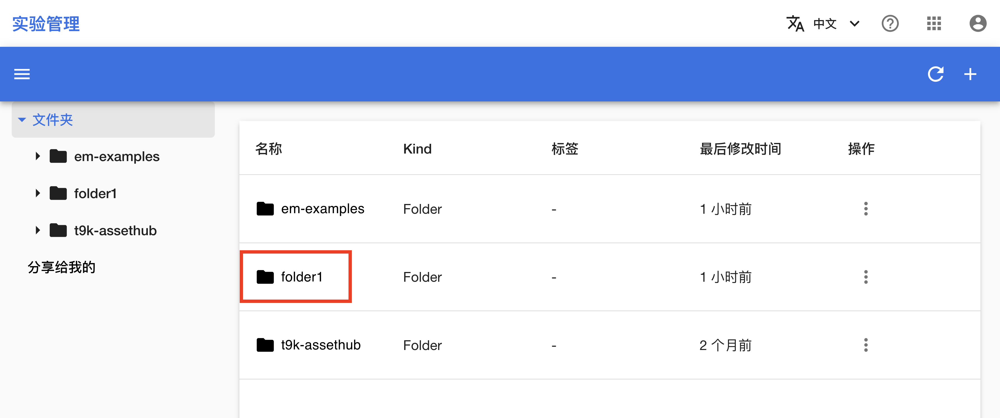
</figure>

使用上方的**面包屑导航**或左侧的**导航菜单**可以返回上级文件夹或跳转到其他文件夹。

<figure class="screenshot">
    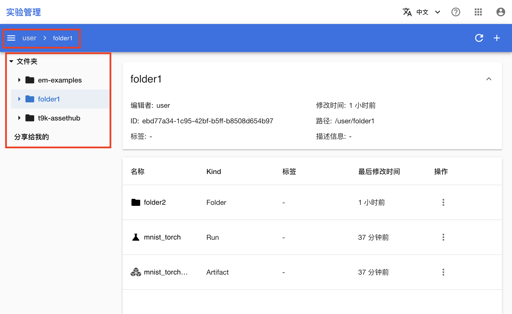
</figure>

## 创建和删除文件夹

若要创建一个文件夹，点击右上角的**添加**，在对话框中提供文件夹名称并点击**创建**。

<figure class="screenshot">
    
</figure>

若要删除一个文件夹，点击文件夹项右侧的**操作**，或点击面包屑导航中的当前文件夹，然后点击**删除**。

<figure class="screenshot">
    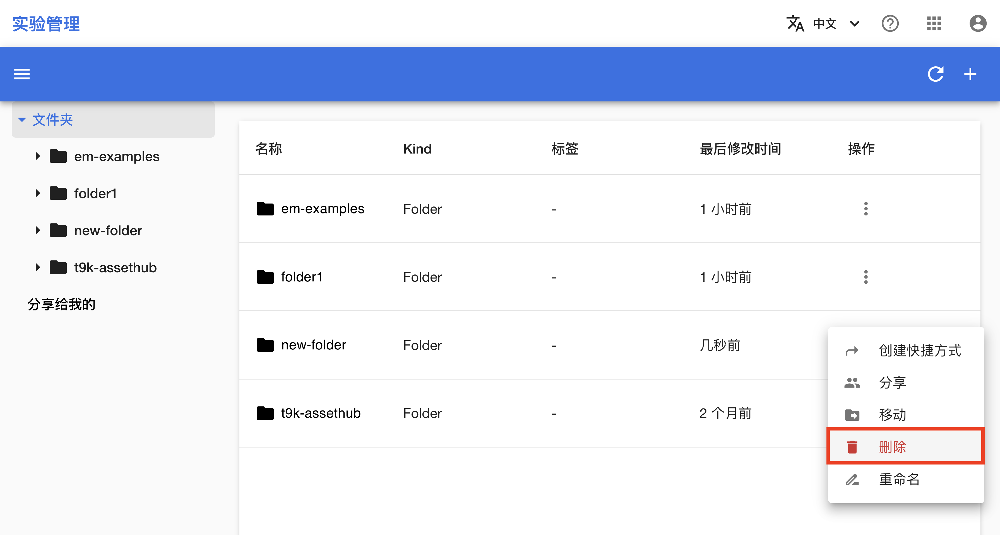
</figure>

<figure class="screenshot">
    
</figure>

## 共享文件夹

点击文件夹项右侧的**操作**，或点击面包屑导航中的当前文件夹，点击**分享**，在对话框中管理文件夹的分享成员列表。空白表示文件夹当前没有被分享给任何其他用户。

<figure class="screenshot">
    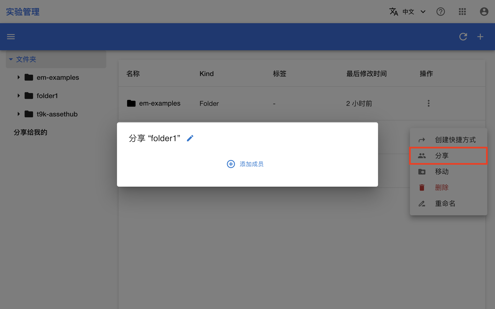
</figure>

分享成员列表可以任意添加（点击**加号**）或移除（点击用户项右侧的**减号**）平台的其他用户或用户组，选择用户或用户组的名称和权限，最后点击**保存**以确定。

<figure class="screenshot">
    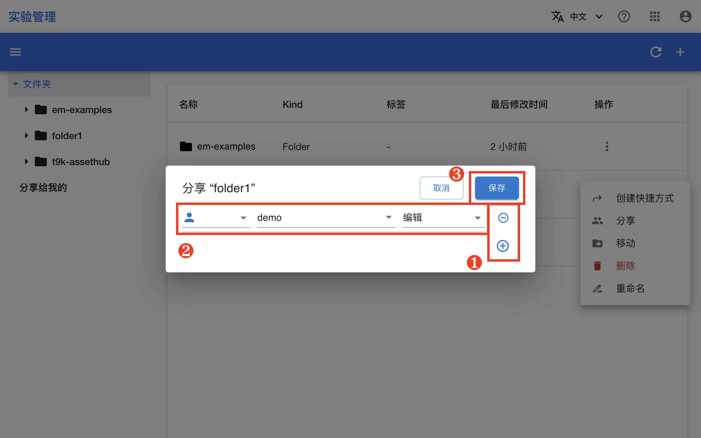
</figure>

来自其他用户分享的文件夹、Run、Artifact 或 AutoTune 将出现在导航菜单的**分享给我的**标签下。

<figure class="screenshot">
    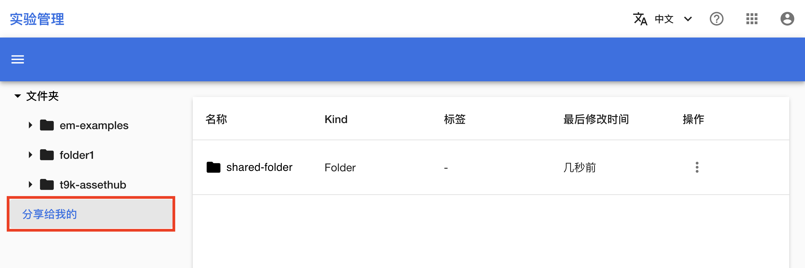
</figure>

## 其他文件夹操作

同样点击文件夹项右侧的**操作**，或点击面包屑导航中的当前文件夹，您还可以进行**创建快捷方式**、**移动**以及**重命名**操作。

## 查看 Run 和 Artifact

点击一个 **Run 或 Artifact 的名称**以进入它的详情页面。

<figure class="screenshot">
    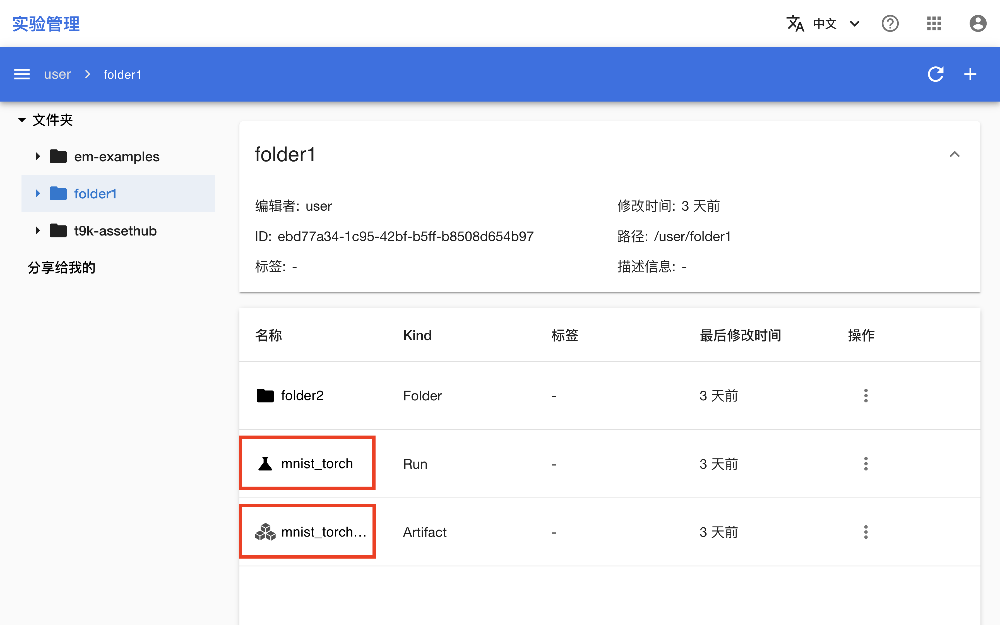
</figure>

Run 的详情页面中，多个标签页分别展示了平台信息、指标、超参数以及数据流。

<figure class="screenshot">
    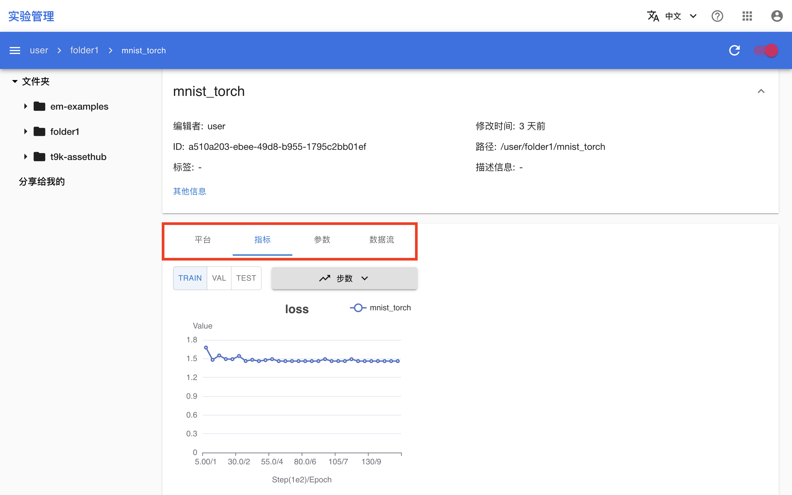
</figure>

Artifact 的详情页面中，多个标签页分别展示了文件列表以及数据流。

<figure class="screenshot">
    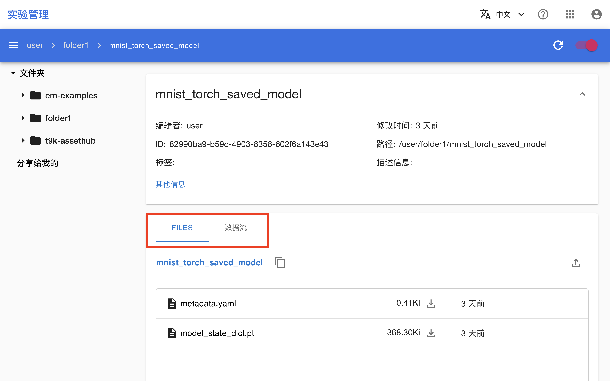
</figure>

## 创建和删除 Run、Artifact 和 AutoTune

创建 Run 和 Artifact 的方法请参阅[使用 Python SDK 记录和上传数据](./record-using-python-sdk.md)；创建 AutoTune 的方法请参阅[使用 AutoTune 进行超参数优化](./autotune.md)。

若要删除一个 Run（或 Artifact、AutoTune，下同），与删除文件夹的操作相同，点击 Run 项右侧的**操作**，或点击面包屑导航中的当前 Run，然后点击**删除**。

<figure class="screenshot">
    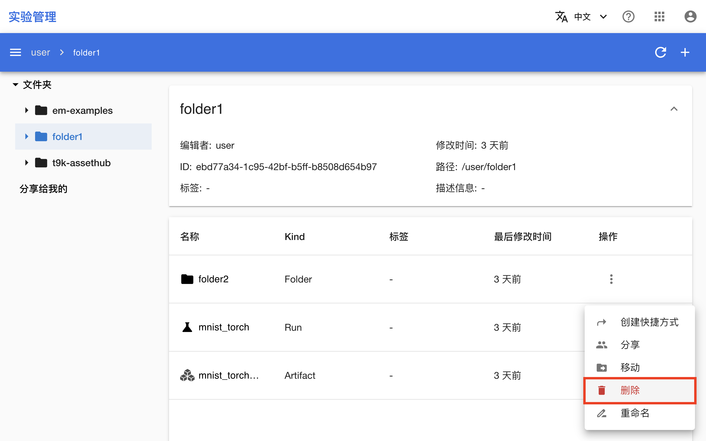
</figure>

## 分享 Run、Artifact 和 AutoTune 以及其他操作

分享 Run（或 Artifact、AutoTune）或者进行其他操作的方法都与文件夹相同，这里不再赘述。

## 退出登录或切换用户

如果您想要退出当前用户的登录，点击右上角的**用户头像**，然后点击**退出登录**。

<figure class="screenshot">
    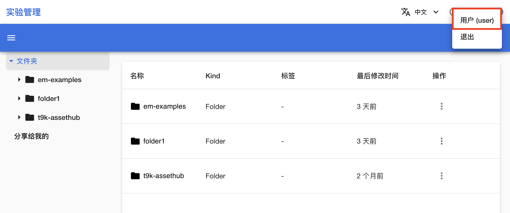
</figure>

再次进入实验管理控制台时，您需要输入用户名和密码以重新登录。
