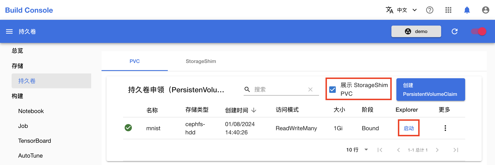
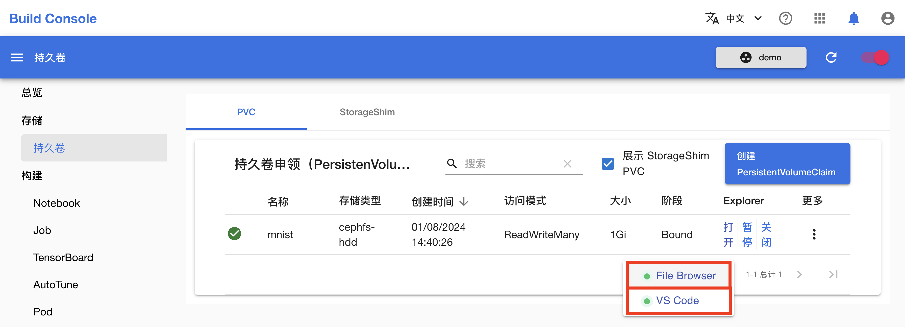
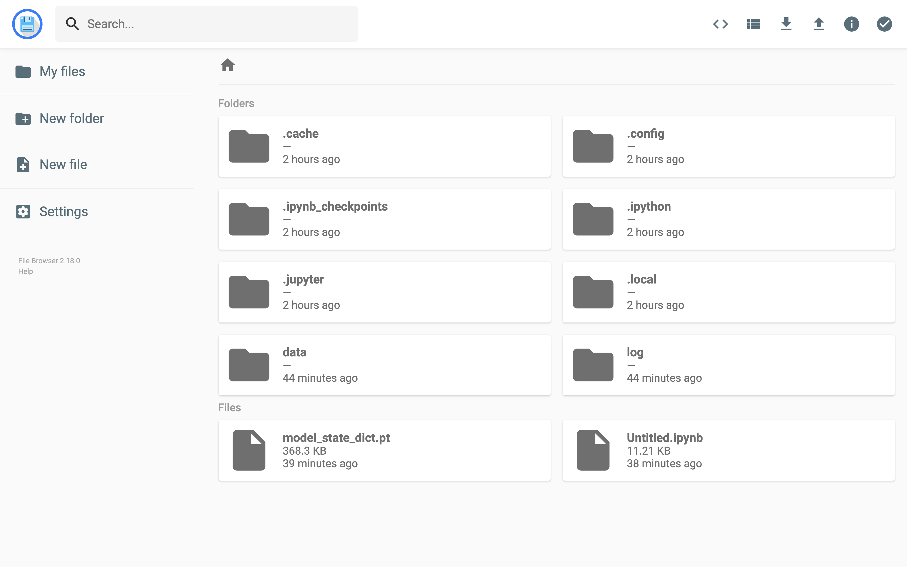
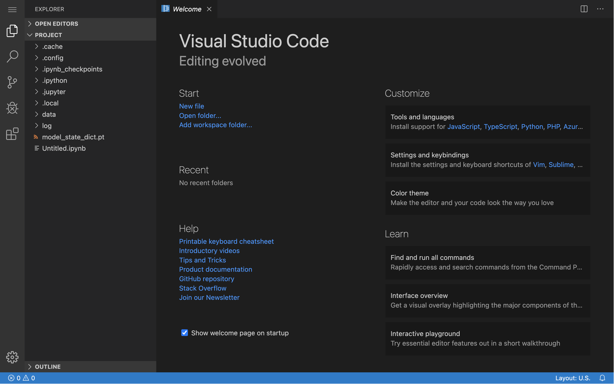
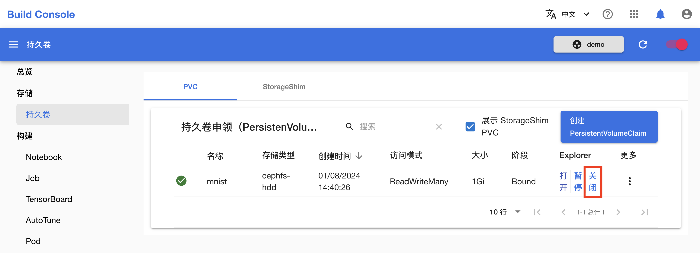

# 使用 Explorer

本教程演示如何使用 [Explorer](../modules/storage/explorer.md) 查看和修改存储在 PVC 和 StorageShim 中的文件。

## 启动 Explorer

在模型构建控制台的左侧导航菜单中点击**存储 > 持久卷**进入 PVC 管理页面，点击 PVC 右侧的**启动**：

<figure class="screenshot">
  
</figure>

<aside class="note tip">

提示

若要启动 StorageShim 的 Explorer，勾选**展示 StorageShim PVC**，然后点击相应 PVC 右侧的**启动**即可。

</aside>

将光标悬停在**打开**上，等待 File Browser 和 VS Code 就绪。随后点击 **File Browser** 和 **VS Code** 即可进入。

<figure class="screenshot">
  
</figure>

</aside>

## 使用 File Browser

</aside>

<aside class="note info">

File Browser

<a target="_blank" rel="noopener noreferrer" href="https://filebrowser.org">File Browser </a> 提供了一个在指定目录内的文件管理界面，它可以用来上传、删除、预览、重命名和编辑文件。它可以作为一个独立的应用程序使用。

</aside>

进入 File Browser 的前端页面，我们可以看到 PVC 中的所有文件和目录：

<figure class="screenshot">
  
</figure>

这里支持以下操作：

* 浏览目录和文本文件
* 创建、删除、重命名、复制、移动目录和文件
* 上传、下载文件
* 修改文本文件

## 使用 VS Code

</aside>

<aside class="note info">

VS Code for the Web

<a target="_blank" rel="noopener noreferrer" href="https://code.visualstudio.com/docs/editor/vscode-web">VS Code for the Web</a> 提供了一个免费的、无需安装的 VS Code 体验，完全在浏览器中运行，允许你快速安全地浏览源代码库并进行轻量级代码更改。

VS Code for the Web 拥有 VS Code 桌面版的许多功能，包括在浏览和编辑时的搜索和语法高亮显示，以及支持扩展以便于你处理代码库和进行简单编辑。除了可以打开来自 GitHub 等源代码控制提供商的代码库、分支和拉取请求外，你还可以处理存储在本地计算机上的代码。

</aside>

进入 File Browser 的前端页面，我们可以看到 PVC 中的所有文件和目录：

<figure class="screenshot">
  
</figure>

这里支持以下操作：

* 浏览目录和文本文件
* 创建、删除、重命名、复制、移动目录和文件
* 修改文本文件，进行轻量级代码修改
* 启动终端并执行命令
* 进行源代码控制
* 安装 VS Code 插件

## 暂停和关闭 Explorer

使用结束后，我们可以**关闭** Explorer。之后重新启用即可。

<figure class="screenshot">
  
</figure>

</aside>

<aside class="note tip">

暂停 Explorer

平台的[资源回收](../modules/computing-resources/reclaim.md)机制会自动暂停空闲时间达到规定值的 Explorer。被暂停的 Explorer 可以被手动恢复。

对于用户而言，手动暂停 Explorer 和关闭 Explorer 的区别不大。

</aside>
