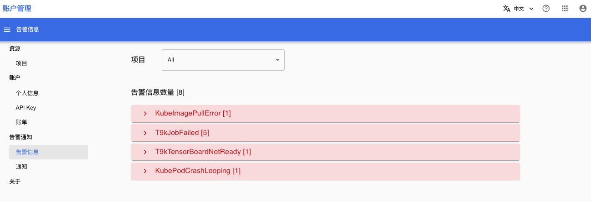
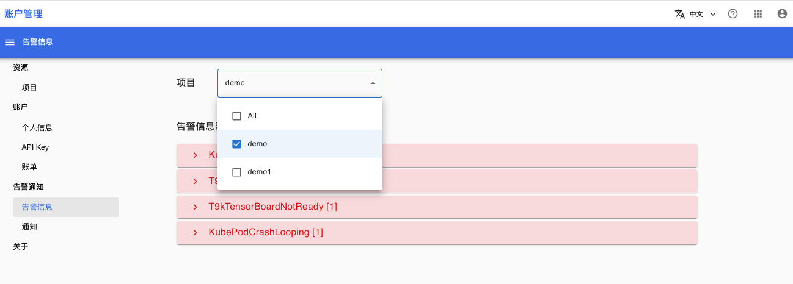
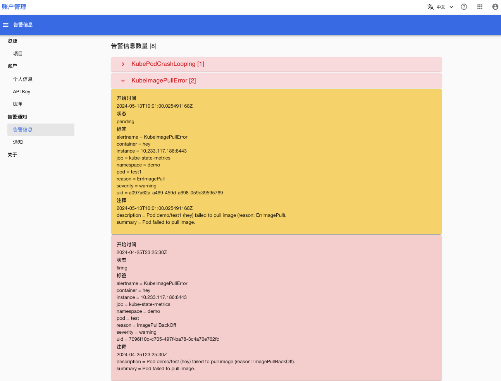

# 查看告警信息

## 准备

* 了解 [告警通知的基本概念](../modules/security/alerts.md)
* 成为一个项目的成员。如果你不是任何一个项目的成员：
    * 请联系平台管理员为你创建一个项目
    * 或联系某个项目管理员将你设为项目成员

## 查看

在浏览器进入“账户管理”控制台之后，在左侧的导航菜单中点击**告警通知 > 告警信息**进入告警信息列表页面。

<figure class="screenshot">
  
</figure>

然后选择你想查看的项目

<figure class="screenshot">
  
</figure>

点击一个具体的告警信息名称，可以展开的告警信息详情。以下图为例，集群中产生了两个 `KubeImagePullError` 告警：
1. 第一个告警信息
    1. 橙色：表明告警处于 pending 状态。pending 意思是告警条件已触发，但还未达到特定时长，系统不会将 pending 告警信息通知给订阅用户。
    2. 描述：Pod `demo/test1（hey）`无法拉取镜像，原因是 ErrImagePull。
2. 第二个告警信息：
    1. 红色：红色表明告警处于 firing 状态。firing 表明告警条件触发时长已经达到特定时长，系统会将 firing 告警信息通知给订阅用户。
    2. 描述：Pod `demo/test（hey）`无法拉取镜像，原因是 ImagePullBackoff。

<figure class="screenshot">
  
</figure>