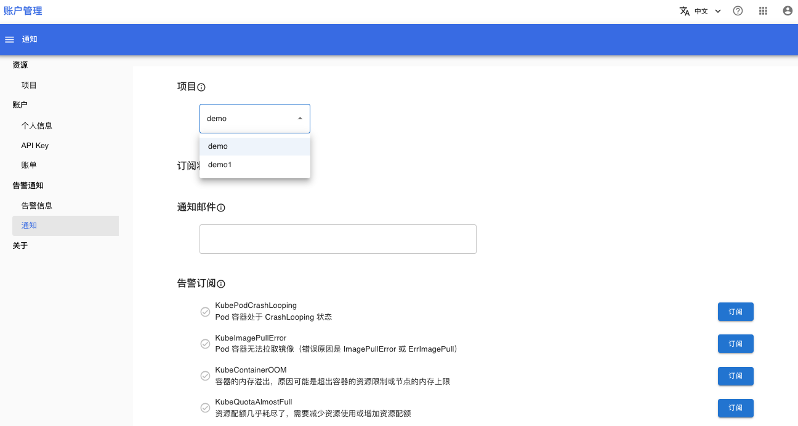

# 订阅告警信息

## 准备

* 了解 [告警通知的基本概念](../modules/security/alerts.md)
* 成为一个项目的成员。如果你不是任何一个项目的成员：
    * 请联系平台管理员为你创建一个项目
    * 或联系某个项目管理员将你设为项目成员

## 订阅

在浏览器进入“账户管理”控制台之后，在左侧的导航菜单中点击**告警通知 > 通知**进入订阅告警信息的页面。

<figure class="screenshot">
  
</figure>

选择一个项目：

<figure class="screenshot">
  
</figure>

填写接收订阅通知的邮箱：

<figure class="screenshot">
  
</figure>

订阅你关心的告警信息，最后点击保存修改按钮，即可完成订阅。

<figure class="screenshot">
  
</figure>

在上述例子中，当项目 demo 中产生 `KubePodCrashLooping`、`KubeImagePullError` 告警信息时，系统会将这些告警发送到邮箱 <demo@tensorstack.com>。
