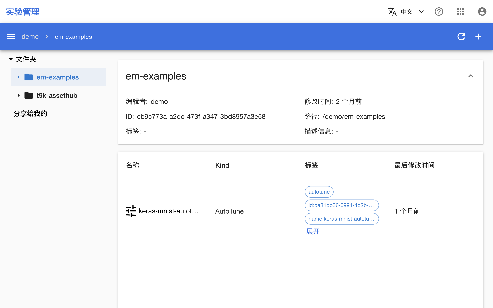
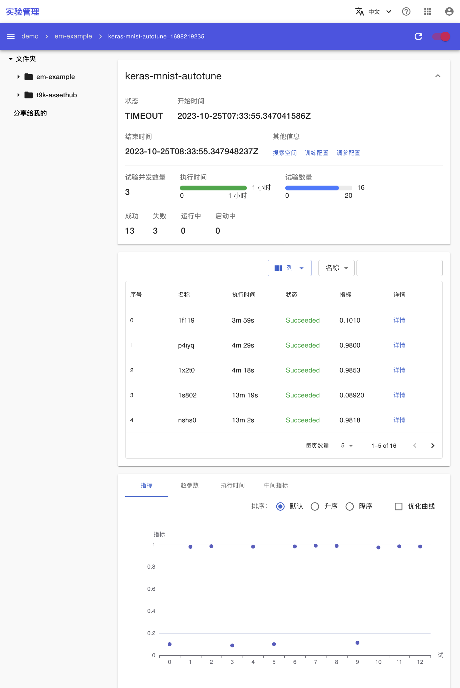
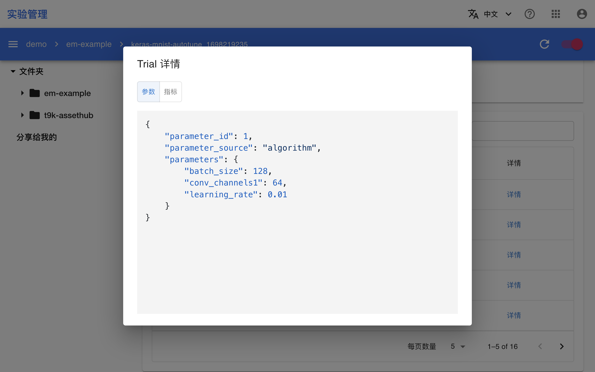
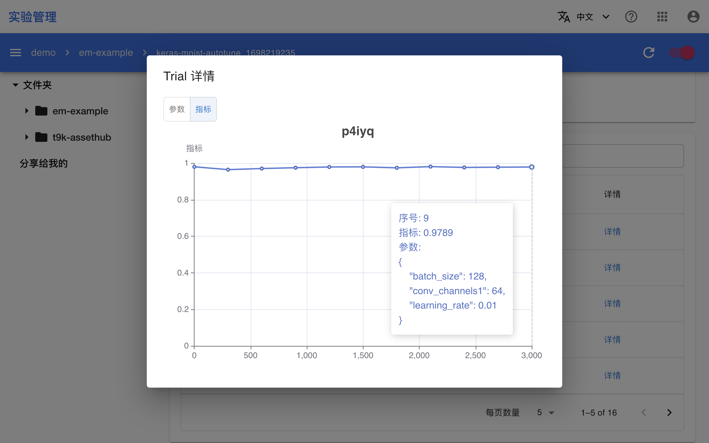

# 在实验管理控制台查看 AutoTune

如果 [AutoTune 使用 AIStore 作为数据库](../modules/building/autotuneexperiment.md#数据库的使用)，那么 AutoTune 会自动记录实验以及其中所有试验的数据到 AIStore 中。

参照[使用 AutoTune 进行超参数优化](./autotune.md)创建一个 AutoTuneExperiment。唯一需要修改的部分是，将 AutoTuneExperiment 配置文件的 `spec.em.folder` 字段修改为文件夹 `em-examples` 的 ID。

创建完成之后，进入实验管理控制台，可以看到 `em-examples/` 路径下出现了一个名为 keras-mnist-autotune 的 AutoTune：

<figure class="screenshot">
    
</figure>

点击**其名称**进入详情页面，可以看到 AutoTuneExperiment 的信息、当前进度、各试验的信息以及可视化图表：

<figure class="screenshot">
    
</figure>

点击任意一个试验的右侧的**详情**可以看到试验使用的超参数以及指标：

<figure class="screenshot">
    
</figure>

<figure class="screenshot">
    
</figure>
